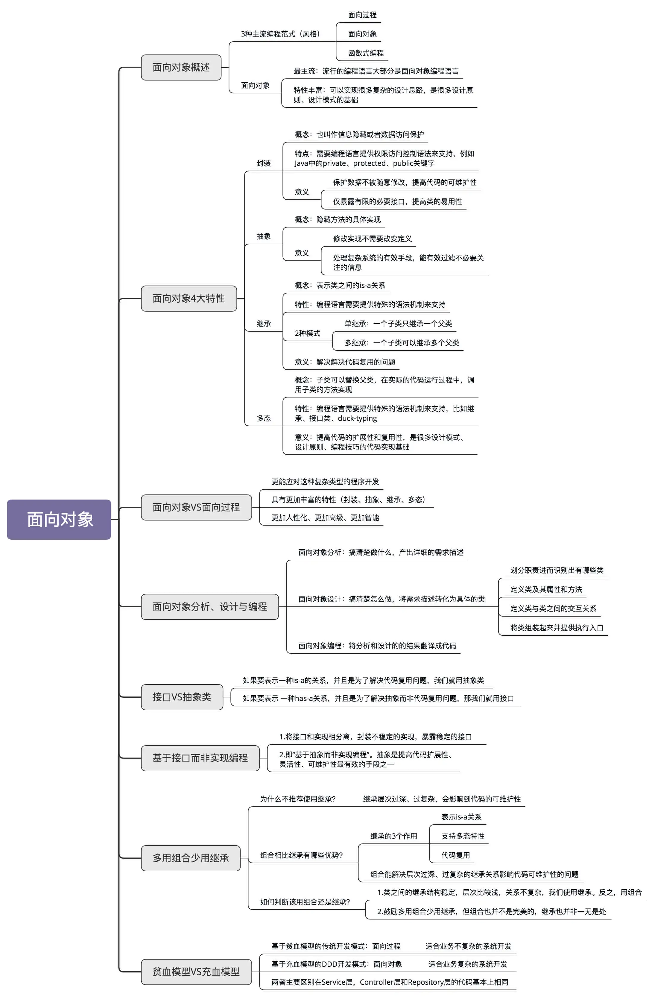

### 1. 面向对象概述

现在，主流的编程范式或者编程风格有三种，它们分别是面向过程、面向对象和函数式编程。面向对象这种编程风格又是这其中最主流的。现在比较流行的编程语言大部分都是面向对象编程语言。大部分项目也都是基于面向对象编程风格开发的。面向对象编程因为其具有丰富的特性（封装、抽象、继承、多态），可以实现很多复杂的设计思路，是很多设计原则、设计模式编码实现的基础。

### 2. 面向对象四大特性

封装也叫作信息隐藏或者数据访问保护。类通过暴露有限的访问接口，授权外部仅能通过类提供的方法来访问内部信息或者数据。它需要编程语言提供权限访问控制语法来支持，例如 Java 中的 private、protected、public 关键字。封装特性存在的意义，一方面是保护数据不被随意修改，提高代码的可维护性；另一方面是仅暴露有限的必要接口，提高类的易用性。

如果说封装主要讲如何隐藏信息、保护数据，那抽象就是讲如何隐藏方法的具体实现，让使用者只需要关心方法提供了哪些功能，不需要知道这些功能是如何实现的。抽象可以通过接口类或者抽象类来实现。抽象存在的意义，一方面是修改实现不需要改变定义；另一方面，它也是处理复杂系统的有效手段，能有效地过滤掉不必要关注的信息。

继承用来表示类之间的 is-a 关系，分为两种模式：单继承和多继承。单继承表示一个子类只继承一个父类，多继承表示一个子类可以继承多个父类。为了实现继承这个特性，编程语言需要提供特殊的语法机制来支持。继承主要是用来解决代码复用的问题。

多态是指子类可以替换父类，在实际的代码运行过程中，调用子类的方法实现。多态这种特性也需要编程语言提供特殊的语法机制来实现，比如继承、接口类、duck-typing。多态可以提高代码的扩展性和复用性，是很多设计模式、设计原则、编程技巧的代码实现基础。

### 3. 面向对象 VS 面向过程

面向对象编程相比面向过程编程的优势主要有三个。

1. 对于大规模复杂程序的开发，程序的处理流程并非单一的一条主线，而是错综复杂的网状结构。面向对象编程比起面向过程编程，更能应对这种复杂类型的程序开发。
2. 面向对象编程相比面向过程编程，具有更加丰富的特性（封装、抽象、继承、多态）。利用这些特性编写出来的代码，更加易扩展、易复用、易维护。
3. 从编程语言跟机器打交道方式的演进规律中，可以总结出：面向对象编程语言比起面向过程编程语言，更加人性化、更加高级、更加智能。

面向对象编程一般使用面向对象编程语言来进行，但是，不用面向对象编程语言，照样可以进行面向对象编程。反过来讲，即便使用面向对象编程语言，写出来的代码也不一定是面向对象编程风格的，也有可能是面向过程编程风格的。

面向对象和面向过程两种编程风格并不是非黑即白、完全对立的。在用面向对象编程语言开发的软件中，面向过程风格的代码并不少见，甚至在一些标准的开发库（比如 JDK、Apache Commons、Google Guava）中，也有很多面向过程风格的代码。

不管使用面向过程还是面向对象哪种风格来写代码，最终的目的还是写出易维护、易读、易复用、易扩展的高质量代码。只要我们能避免面向过程编程风格的一些弊端，控制好它的副作用，在掌控范围内为我们所用，就大可不用避讳在面向对象编程中写面向过程风格的代码。

### 4. 面向对象分析、设计与编程

面向对象分析（OOA）、面向对象设计（OOD）、面向对象编程（OOP），是面向对象开发的三个主要环节。简单点讲，面向对象分析就是要搞清楚做什么，面向对象设计就是要搞清楚怎么做，面向对象编程就是将分析和设计的的结果翻译成代码的过程。

需求分析的过程实际上是一个不断迭代优化的过程。不要试图一下就给出一个完美的解决方案，而是先给出一个粗糙的、基础的方案，有一个迭代的基础，然后再慢慢优化。这样一个思考过程能摆脱无从下手的窘境。

面向对象设计和实现要做的事情就是把合适的代码放到合适的类中。至于到底选择哪种划分方法，判定的标准是让代码尽量地满足“松耦合、高内聚”、单一职责、对扩展开放对修改关闭等我们之前讲到的各种设计原则和思想，尽量地做到代码可复用、易读、易扩展、易维护。

面向对象分析的产出是详细的需求描述。面向对象设计的产出是类。在面向对象设计这一环节中，将需求描述转化为具体的类的设计。这个环节的工作可以拆分为下面四个部分。

- 划分职责进而识别出有哪些类

根据需求描述，把其中涉及的功能点，一个一个罗列出来，然后再去看哪些功能点职责相近，操作同样的属性，可否归为同一个类。

- 定义类及其属性和方法

识别出需求描述中的动词，作为候选的方法，再进一步过滤筛选出真正的方法，把功能点中涉及的名词，作为候选属性，然后同样再进行过滤筛选。

- 定义类与类之间的交互关系

UML 统一建模语言中定义了六种类之间的关系。它们分别是：泛化、实现、关联、聚合、组合、依赖。我们从更加贴近编程的角度，对类与类之间的关系做了调整，保留了四个关系：泛化、实现、组合、依赖。

- 将类组装起来并提供执行入口

要将所有的类组装在一起，提供一个执行入口。这个入口可能是一个 main() 函数，也可能是一组给外部用的 API 接口。通过这个入口，能触发整个代码跑起来。

### 5. 接口 VS 抽象类

抽象类不允许被实例化，只能被继承。它可以包含属性和方法。方法既可以包含代码实现，也可以不包含代码实现。不包含代码实现的方法叫作抽象方法。子类继承抽象类，必须实现抽象类中的所有抽象方法。接口不能包含属性（Java 可以定义静态常量），只能声明方法，方法不能包含代码实现（Java8 以后可以有默认实现）。类实现接口的时候，必须实现接口中声明的所有方法。

抽象类是对成员变量和方法的抽象，是一种 is-a 关系，是为了解决代码复用问题。接口仅仅是对方法的抽象，是一种 has-a 关系，表示具有某一组行为特性，是为了解决解耦问题，隔离接口和具体的实现，提高代码的扩展性。

什么时候该用抽象类？什么时候该用接口？实际上，判断的标准很简单。如果要表示一种 is-a 的关系，并且是为了解决代码复用问题，就用抽象类；如果要表示一种 has-a 关系，并且是为了解决抽象而非代码复用问题，那我们就用接口。

### 6. 基于接口而非实现编程

应用这条原则，可以将接口和实现相分离，封装不稳定的实现，暴露稳定的接口。上游系统面向接口而非实现编程，不依赖不稳定的实现细节，这样当实现发生变化的时候，上游系统的代码基本上不需要做改动，以此来降低耦合性，提高扩展性。

实际上，“基于接口而非实现编程”这条原则的另一个表述方式是，“基于抽象而非实现编程”。后者的表述方式其实更能体现这条原则的设计初衷。在软件开发中，最大的挑战之一就是需求的不断变化，这也是考验代码设计好坏的一个标准。

越抽象、越顶层、越脱离具体某一实现的设计，越能提高代码的灵活性，越能应对未来的需求变化。好的代码设计，不仅能应对当下的需求，而且在将来需求发生变化的时候，仍然能够在不破坏原有代码设计的情况下灵活应对。而抽象就是提高代码扩展性、灵活性、可维护性最有效的手段之一。

### 7. 多用组合少用继承

#### 7.1 为什么不推荐使用继承？

继承是面向对象的四大特性之一，用来表示类之间的 is-a 关系，可以解决代码复用的问题。虽然继承有诸多作用，但继承层次过深、过复杂，也会影响到代码的可维护性。在这种情况下，我们应该尽量少用，甚至不用继承。

#### 7.2 组合相比继承有哪些优势？

继承主要有三个作用：表示 is-a 关系、支持多态特性、代码复用。而这三个作用都可以通过组合、接口、委托三个技术手段来达成。除此之外，利用组合还能解决层次过深、过复杂的继承关系影响代码可维护性的问题。

#### 7.3 如何判断该用组合还是继承？

尽管鼓励多用组合少用继承，但组合也并不是完美的，继承也并非一无是处。在实际的项目开发中，还是要根据具体的情况，来选择该用继承还是组合。如果类之间的继承结构稳定，层次比较浅，关系不复杂，就可以大胆地使用继承。反之，就尽量使用组合来替代继承。除此之外，还有一些设计模式、特殊的应用场景，会固定使用继承或者组合。

### 8. 贫血模型 VS 充血模型

平时做 Web 项目的业务开发，大部分都是基于贫血模型的 MVC 三层架构，在专栏中我把它称为传统的开发模式。之所以称之为“传统”，是相对于新兴的基于充血模型的 DDD 开发模式来说的。基于贫血模型的传统开发模式，是典型的面向过程的编程风格。相反，基于充血模型的 DDD 开发模式，是典型的面向对象的编程风格。

不过，DDD 也并非银弹。对于业务不复杂的系统开发来说，基于贫血模型的传统开发模式简单够用，基于充血模型的 DDD 开发模式有点大材小用，无法发挥作用。相反，对于业务复杂的系统开发来说，基于充血模型的 DDD 开发模式，因为前期需要在设计上投入更多时间和精力，来提高代码的复用性和可维护性，所以相比基于贫血模型的开发模式，更加有优势。

基于充血模型的 DDD 开发模式跟基于贫血模型的传统开发模式相比，主要区别在 Service 层。在基于充血模型的开发模式下，我们将部分原来在 Service 类中的业务逻辑移动到了一个充血的 Domain 领域模型中，让 Service 类的实现依赖这个 Domain 类。不过，Service 类并不会完全移除，而是负责一些不适合放在 Domain 类中的功能。比如，负责与 Repository 层打交道、跨领域模型的业务聚合功能、幂等事务等非功能性的工作。

基于充血模型的 DDD 开发模式跟基于贫血模型的传统开发模式相比，Controller 层和 Repository 层的代码基本上相同。这是因为，Repository 层的 Entity 生命周期有限，Controller 层的 VO 只是单纯作为一种 DTO。两部分的业务逻辑都不会太复杂。业务逻辑主要集中在 Service 层。所以，Repository 层和 Controller 层继续沿用贫血模型的设计思路是没有问题的。

