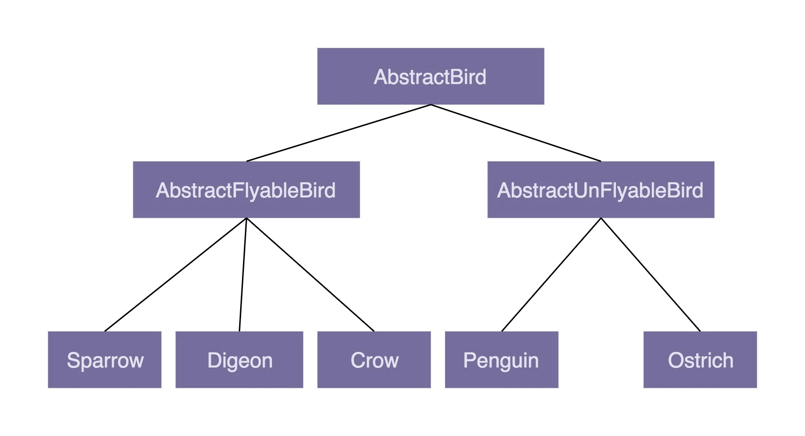
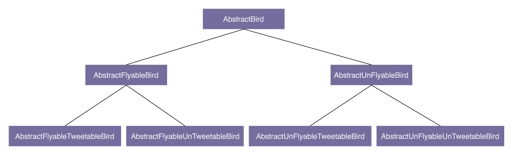

在面向对象编程中，有一条非常经典的设计原则，那就是：**组合优于继承，多用组合少用继承**。

# 1. 为什么不推荐使用继承？

继承是面向对象的四大特性之一，用来表示类之间的 is-a 关系，可以解决代码复用的问题。虽然继承有诸多作用，但继承层次过深、过复杂，也会影响到代码的可维护性。种情况下，我们应该尽量少用，甚至不用继承。

假设要设计一个关于鸟的类。将“鸟类”这样一个抽象的事物概念，定义为一个抽象类 AbstractBird。所有更细分的鸟，比如麻雀、鸽子、乌鸦等，都继承这个抽象类。

我们知道，大部分鸟都会飞，那可不可以在 AbstractBird 抽象类中，定义一个 fly() 方法呢？答案是否定的。尽管大部分鸟都会飞，但也有特例，比如鸵鸟就不会飞。鸵鸟继承具有 fly() 方法的父类，那鸵鸟就具有“飞”这样的行为，这显然不符合我们对现实世界中事物的认识。当然，你可能会说，我在鸵鸟这个子类中重写（override）fly() 方法，让它抛出 UnSupportedMethodException 异常不就可以了吗？

这种设计思路虽然可以解决问题，但不够优美。对于这些不会飞的鸟来说，都需要重写 fly() 方法，抛出异常。这样的设计，一方面，徒增了编码的工作量；另一方面，也违背了我们之后要讲的最小知识原则（Least Knowledge Principle，也叫最少知识原则或者迪米特法则），暴露不该暴露的接口给外部，增加了类使用过程中被误用的概率。

那我们再通过 AbstractBird 类派生出两个更加细分的抽象类：会飞的鸟类 AbstractFlyableBird 和不会飞的鸟类 AbstractUnFlyableBird，让麻雀、乌鸦这些会飞的鸟都继承 AbstractFlyableBird，让鸵鸟、企鹅这些不会飞的鸟，都继承 AbstractUnFlyableBird 类，不就可以了吗？具体的继承关系如下图所示：



在刚刚这个场景中，只关注“鸟会不会飞”，但如果还关注“鸟会不会叫”，那这个时候，又该如何设计类之间的继承关系呢？两个行为搭配起来会产生四种情况：会飞会叫、不会飞会叫、会飞不会叫、不会飞不会叫。如果我们继续沿用刚才的设计思路，那就需要再定义四个抽象类



总之，继承最大的问题就在于：继承层次过深、继承关系过于复杂会影响到代码的可读性和可维护性。

# 2. 组合相比继承有哪些优势？

继承主要有三个作用：表示 is-a 关系，支持多态特性，代码复用。而这三个作用都可以通过组合、接口、委托三个技术手段来达成。除此之外，利用组合还能解决层次过深、过复杂的继承关系影响代码可维护性的问题。

接口表示具有某种行为特性。针对“会飞”这样一个行为特性，可以定义一个 Flyable 接口，只让会飞的鸟去实现这个接口。对于会叫、会下蛋这些行为特性，可以类似地定义 Tweetable 接口、EggLayable 接口。

可以针对三个接口再定义三个实现类，它们分别是：实现了 fly() 方法的 FlyAbility 类、实现了 tweet() 方法的 TweetAbility 类、实现了 layEgg() 方法的 EggLayAbility 类。然后，通过组合和委托技术来消除代码重复。

```java
public class Ostrich implements Tweetable, EggLayable {//鸵鸟
  private TweetAbility tweetAbility = new TweetAbility(); //组合
  private EggLayAbility eggLayAbility = new EggLayAbility(); //组合
  //... 省略其他属性和方法...
  @Override
  public void tweet() {
    tweetAbility.tweet(); // 委托
  }
  @Override
  public void layEgg() {
    eggLayAbility.layEgg(); // 委托
  }
}
```

# 3. 如何判断该用组合还是继承？

尽管鼓励多用组合少用继承，但组合也并不是完美的，继承也并非一无是处。在实际的项目开发中，还是要根据具体的情况，来选择该用继承还是组合。如果类之间的继承结构稳定，层次比较浅，关系不复杂，就可以大胆地使用继承。反之，就尽量使用组合来替代继承。除此之外，还有一些设计模式、特殊的应用场景，会固定使用继承或者组合。

还有一些设计模式会固定使用继承或者组合。比如，装饰者模式（decorator pattern）、策略模式（strategy pattern）、组合模式（composite pattern）等都使用了组合关系，而模板模式（template pattern）使用了继承关系。

如果你不能改变一个函数的入参类型，而入参又非接口，为了支持多态，只能采用继承来实现。


