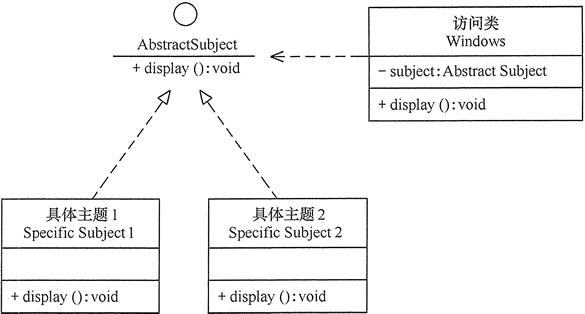

# 1.开闭原则OCP

开闭原则的英文全称是 Open Closed Principle，简写为 OCP。它的英文描述是：software entities (modules, classes, functions, etc.) should be open for extension , but closed for modification。我们把它翻译成中文就是：软件实体（模块、类、方法等）应该“对扩展开放、对修改关闭”。

这个描述比较简略，如果详细表述一下，那就是，**添加一个新的功能应该是，在已有代码基础上扩展代码（新增模块、类、方法等），而非修改已有代码（修改模块、类、方法等）**。

关于定义，我们有两点要注意。第一点是，开闭原则并不是说完全杜绝修改，而是以最小的修改代码的代价来完成新功能的开发。第二点是，同样的代码改动，在粗代码粒度下，可能被认定为“修改”；在细代码粒度下，可能又被认定为“扩展”。

要认识到，添加一个新功能，不可能任何模块、类、方法的代码都不“修改”，这个是做不到的。类需要创建、组装、并且做一些初始化操作，才能构建成可运行的的程序，这部分代码的修改是在所难免的。我们要做的是尽量让修改操作更集中、更少、更上层，尽量让最核心、最复杂的那部分逻辑代码满足开闭原则。

# 2. 如何做到“对扩展开放、修改关闭”？

开闭原则讲的就是代码的扩展性问题，是判断一段代码是否易扩展的“金标准”。

我们要时刻具备扩展意识、抽象意识、封装意识。在写代码的时候，我们要多花点时间思考一下，这段代码未来可能有哪些需求变更，如何设计代码结构，事先留好扩展点，以便在未来需求变更的时候，在不改动代码整体结构、做到最小代码改动的情况下，将新的代码灵活地插入到扩展点上。

很多设计原则、设计思想、设计模式，都是以提高代码的扩展性为最终目的的。特别是 23 种经典设计模式，大部分都是为了解决代码的扩展性问题而总结出来的，都是以开闭原则为指导原则的。最常用来提高代码扩展性的方法有：多态、依赖注入、基于接口而非实现编程，以及大部分的设计模式（比如，装饰、策略、模板、职责链、状态）。

# 3.开闭原则的作用

开闭原则是**面向对象程序设计的终极目标**，它使软件实体拥有一定的适应性和灵活性的同时具备稳定性和延续性。具体来说，其作用如下。

## 3.1 对软件测试的影响

软件遵守开闭原则的话，软件测试时只需要对扩展的代码进行测试就可以了，因为原有的测试代码仍然能够正常运行。

## 3.2 可以提高代码的可复用性

粒度越小，被复用的可能性就越大；在面向对象的程序设计中，根据原子和抽象编程可以提高代码的可复用性。

## 3.3 可以提高软件的可维护性

遵守开闭原则的软件，其稳定性高和延续性强，从而易于扩展和维护。

# 4.开闭原则的实现方法

可以通过“**抽象约束、封装变化**”来实现开闭原则，即通过接口或者抽象类为软件实体定义一个相对稳定的抽象层，而将相同的可变因素封装在相同的具体实现类中。

因为抽象灵活性好，适应性广，只要抽象的合理，可以基本保持软件架构的稳定。而软件中易变的细节可以从抽象派生来的实现类来进行扩展，当软件需要发生变化时，只需要根据需求重新派生一个实现类来扩展就可以了。

如Windows 的桌面主题设计：Windows 的主题是桌面背景图片、窗口颜色和声音等元素的组合。用户可以根据自己的喜爱更换自己的桌面主题，也可以从网上下载新的主题。这些主题有共同的特点，可以为其定义一个抽象类（Abstract Subject），而每个具体的主题（Specific Subject）是其子类。用户窗体可以根据需要选择或者增加新的主题，而不需要修改原代码，所以它是满足开闭原则的，其类图如图所示。

