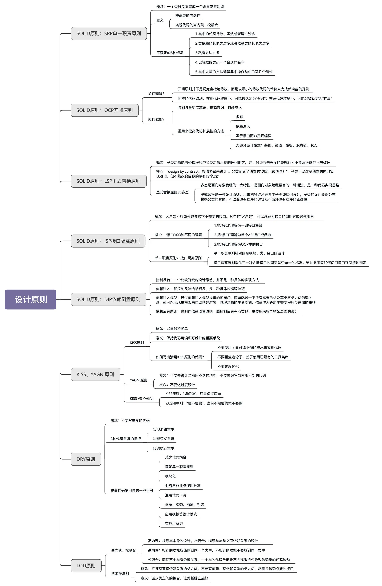

### 1.SOLID 原则：SRP 单一职责原则

一个类只负责完成一个职责或者功能。单一职责原则通过避免设计大而全的类，避免将不相关的功能耦合在一起，来提高类的内聚性。同时，类职责单一，类依赖的和被依赖的其他类也会变少，减少了代码的耦合性，以此来实现代码的高内聚、松耦合。但是，如果拆分得过细，实际上会适得其反，反倒会降低内聚性，也会影响代码的可维护性。

不同的应用场景、不同阶段的需求背景、不同的业务层面，对同一个类的职责是否单一，可能会有不同的判定结果。实际上，一些侧面的判断指标更具有指导意义和可执行性，比如，出现下面这些情况就有可能说明这类的设计不满足单一职责原则：

- 类中的代码行数、函数或者属性过多；
- 类依赖的其他类过多或者依赖类的其他类过多；
- 私有方法过多；
- 比较难给类起一个合适的名字；
- 类中大量的方法都是集中操作类中的某几个属性。

### 2.SOLID 原则：OCP 开闭原则

#### 2.1 如何理解“对扩展开放、修改关闭”？

添加一个新的功能，应该是通过在已有代码基础上扩展代码（新增模块、类、方法、属性等），而非修改已有代码（修改模块、类、方法、属性等）的方式来完成。关于定义，我们有两点要注意。第一点是，开闭原则并不是说完全杜绝修改，而是以最小的修改代码的代价来完成新功能的开发。第二点是，同样的代码改动，在粗代码粒度下，可能被认定为“修改”；在细代码粒度下，可能又被认定为“扩展”。

#### 2.2 如何做到“对扩展开放、修改关闭”？

要时刻具备扩展意识、抽象意识、封装意识。在写代码的时候，要多花点时间思考一下，这段代码未来可能有哪些需求变更，如何设计代码结构，事先留好扩展点，以便在未来需求变更的时候，在不改动代码整体结构、做到最小代码改动的情况下，将新的代码灵活地插入到扩展点上。

很多设计原则、设计思想、设计模式，都是以提高代码的扩展性为最终目的的。特别是 23 种经典设计模式，大部分都是为了解决代码的扩展性问题而总结出来的，都是以开闭原则为指导原则的。最常用来提高代码扩展性的方法有：多态、依赖注入、基于接口而非实现编程，以及大部分的设计模式（比如，装饰、策略、模板、职责链、状态）。

### 3.SOLID 原则：LSP 里式替换原则

子类对象（object of subtype/derived class）能够替换程序（program）中父类对象（object of base/parent class）出现的任何地方，并且保证原来程序的逻辑行为（behavior）不变及正确性不被破坏。

里式替换原则是用来指导继承关系中子类该如何设计的一个原则。理解里式替换原则，最核心的就是理解“design by contract，按照协议来设计”这几个字。父类定义了函数的“约定”（或者叫协议），那子类可以改变函数的内部实现逻辑，但不能改变函数的原有“约定”。这里的“约定”包括：函数声明要实现的功能；对输入、输出、异常的约定；甚至包括注释中所罗列的任何特殊说明。

理解这个原则，还要弄明白，里式替换原则跟多态的区别。虽然从定义描述和代码实现上来看，多态和里式替换有点类似，但它们关注的角度是不一样的。多态是面向对象编程的一大特性，也是面向对象编程语言的一种语法。它是一种代码实现的思路。而里式替换是一种设计原则，用来指导继承关系中子类该如何设计，子类的设计要保证在替换父类的时候，不改变原有程序的逻辑及不破坏原有程序的正确性。

### 4.SOLID 原则：ISP 接口隔离原则

接口隔离原则的描述是：客户端不应该强迫依赖它不需要的接口。其中的“客户端”，可以理解为接口的调用者或者使用者。理解“接口隔离原则”的重点是理解其中的“接口”二字。这里有三种不同的理解。

如果把“接口”理解为一组接口集合，可以是某个微服务的接口，也可以是某个类库的接口等。如果部分接口只被部分调用者使用，就需要将这部分接口隔离出来，单独给这部分调用者使用，而不强迫其他调用者也依赖这部分不会被用到的接口。

如果把“接口”理解为单个 API 接口或函数，部分调用者只需要函数中的部分功能，那就需要把函数拆分成粒度更细的多个函数，让调用者只依赖它需要的那个细粒度函数。

如果把“接口”理解为 OOP 中的接口，也可以理解为面向对象编程语言中的接口语法。那接口的设计要尽量单一，不要让接口的实现类和调用者，依赖不需要的接口函数。

单一职责原则针对的是模块、类、接口的设计。接口隔离原则相对于单一职责原则，一方面更侧重于接口的设计，另一方面它的思考的角度也是不同的。接口隔离原则提供了一种判断接口的职责是否单一的标准：通过调用者如何使用接口来间接地判定。如果调用者只使用部分接口或接口的部分功能，那接口的设计就不够职责单一。

### 5.SOLID 原则：DIP 依赖倒置原则

**控制反转：**实际上，控制反转是一个比较笼统的设计思想，并不是一种具体的实现方法，一般用来指导框架层面的设计。这里所说的“控制”指的是对程序执行流程的控制，而“反转”指的是在没有使用框架之前，程序员自己控制整个程序的执行。在使用框架之后，整个程序的执行流程通过框架来控制。流程的控制权从程序员“反转”给了框架。

**依赖注入：**依赖注入和控制反转恰恰相反，它是一种具体的编码技巧。不通过 new 的方式在类内部创建依赖类的对象，而是将依赖的类对象在外部创建好之后，通过构造函数、函数参数等方式传递（或“注入”）给类来使用。

**依赖注入框架：**通过依赖注入框架提供的扩展点，简单配置一下所有需要的类及其类与类之间的依赖关系，就可以实现由框架来自动创建对象、管理对象的生命周期、依赖注入等原本需要程序员来做的事情。

**依赖反转原则：**依赖反转原则也叫作依赖倒置原则。这条原则跟控制反转有点类似，主要用来指导框架层面的设计。高层模块不依赖低层模块，它们共同依赖同一个抽象。抽象不需要依赖具体实现细节，具体实现细节依赖抽象。

### 6.KISS、YAGNI 原则

KISS 原则的中文描述是：尽量保持简单。KISS 原则是保持代码可读和可维护的重要手段。KISS 原则中的“简单“”并不是以代码行数来考量的。代码行数越少并不代表代码越简单，我们还要考虑逻辑复杂度、实现难度、代码的可读性等。而且，本身就复杂的问题，用复杂的方法解决，也并不违背 KISS 原则。除此之外，同样的代码，在某个业务场景下满足 KISS 原则，换一个应用场景可能就不满足了。

对于如何写出满足 KISS 原则的代码，总结了下面几条指导原则：

- 不要使用同事可能不懂的技术来实现代码；
- 不要重复造轮子，善于使用已经有的工具类库；
- 不要过度优化。

YAGNI 原则的英文全称是：You Ain’t Gonna Need It。直译就是：你不会需要它。这条原则也算是万金油了。当用在软件开发中的时候，它的意思是：不要去设计当前用不到的功能；不要去编写当前用不到的代码。实际上，这条原则的核心思想就是：不要做过度设计。

YAGNI 原则跟 KISS 原则并非一回事儿。KISS 原则讲的是“如何做”的问题（尽量保持简单），而 YAGNI 原则说的是“要不要做”的问题（当前不需要的就不要做）。

### 7.DRY 原则

DRY 原则中文描述是：不要重复自己，将它应用在编程中，可以理解为：不要写重复的代码。

三种代码重复的情况：实现逻辑重复、功能语义重复、代码执行重复。实现逻辑重复，但功能语义不重复的代码，并不违反 DRY 原则。实现逻辑不重复，但功能语义重复的代码，也算是违反 DRY 原则。而代码执行重复也算是违反 DRY 原则。

除此之外，提高代码复用性的一些手段，包括：减少代码耦合、满足单一职责原则、模块化、业务与非业务逻辑分离、通用代码下沉、继承、多态、抽象、封装、应用模板等设计模式。复用意识也非常重要。在设计每个模块、类、函数的时候，要像设计一个外部 API 一样去思考它的复用性。

在第一次写代码的时候，如果当下没有复用的需求，而未来的复用需求也不是特别明确，并且开发可复用代码的成本比较高，那就不需要考虑代码的复用性。在之后开发新的功能的时候，发现可以复用之前写的这段代码，那我们就重构这段代码，让其变得更加可复用。

相比于代码的可复用性，DRY 原则适用性更强些。我们可以不写可复用的代码，但一定不能写重复的代码。

### 8.LOD 原则

#### 8.1 如何理解“高内聚、松耦合”？

“高内聚、松耦合”是一个非常重要的设计思想，能够有效提高代码的可读性和可维护性，缩小功能改动导致的代码改动范围。“高内聚”用来指导类本身的设计，“松耦合”用来指导类与类之间依赖关系的设计。所谓高内聚，就是指相近的功能应该放到同一个类中，不相近的功能不要放到同一类中。相近的功能往往会被同时修改，放到同一个类中，修改会比较集中。所谓“松耦合”指的是，在代码中，类与类之间的依赖关系简单清晰。即使两个类有依赖关系，一个类的代码改动也不会或者很少导致依赖类的代码改动。

#### 8.2 如何理解“迪米特法则”？

迪米特法则的描述为：不该有直接依赖关系的类之间，不要有依赖；有依赖关系的类之间，尽量只依赖必要的接口。迪米特法则是希望减少类之间的耦合，让类越独立越好。每个类都应该少了解系统的其他部分。一旦发生变化，需要了解这一变化的类就会比较少。

