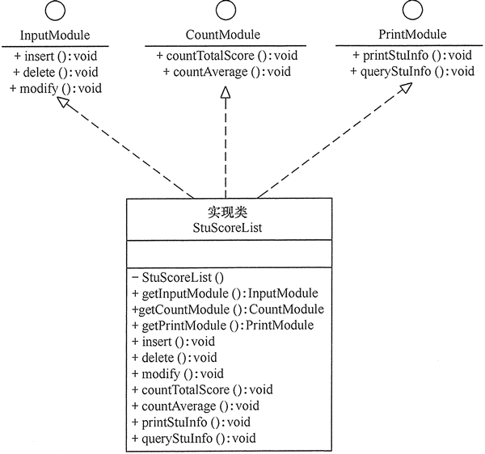

# 1. 接口隔离原则ISP

接口隔离原则的英文翻译是“ Interface Segregation Principle”，缩写为 ISP。Robert Martin 在 SOLID 原则中是这样定义它的：“Clients should not be forced to depend upon interfaces that they do not use。”直译成中文的话就是：客户端不应该被强迫依赖它不需要的接口。其中的“客户端”，可以理解为接口的调用者或者使用者。

以上定义的含义是：要为各个类建立它们需要的专用接口，而不要试图去建立一个很庞大的接口供所有依赖它的类去调用。

理解“接口隔离原则”的重点是理解其中的“接口”二字。这里有三种不同的理解。

1. 如果把“接口”理解为一组接口集合，可以是某个微服务的接口，也可以是某个类库的接口等。如果部分接口只被部分调用者使用，我们就需要将这部分接口隔离出来，单独给这部分调用者使用，而不强迫其他调用者也依赖这部分不会被用到的接口。
2. 如果把“接口”理解为单个 API 接口或函数，部分调用者只需要函数中的部分功能，那我们就需要把函数拆分成粒度更细的多个函数，让调用者只依赖它需要的那个细粒度函数。
3. 如果把“接口”理解为 OOP 中的接口，也可以理解为面向对象编程语言中的接口语法。那接口的设计要尽量单一，不要让接口的实现类和调用者，依赖不需要的接口函数。

# 2.接口隔离原则的优点

接口隔离原则是为了约束接口、降低类对接口的依赖性，遵循接口隔离原则有以下 5 个优点。

1. 将臃肿庞大的接口分解为多个粒度小的接口，可以预防外来变更的扩散，提高系统的灵活性和可维护性。
2. 接口隔离提高了系统的内聚性，减少了对外交互，降低了系统的耦合性。
3. 如果接口的粒度大小定义合理，能够保证系统的稳定性；但是，如果定义过小，则会造成接口数量过多，使设计复杂化；如果定义太大，灵活性降低，无法提供定制服务，给整体项目带来无法预料的风险。
4. 使用多个专门的接口还能够体现对象的层次，因为可以通过接口的继承，实现对总接口的定义。
5. 能减少项目工程中的代码冗余。过大的大接口里面通常放置许多不用的方法，当实现这个接口的时候，被迫设计冗余的代码。

# 3.接口隔离原则与单一职责原则的区别

单一职责原则针对的是模块、类、接口的设计。接口隔离原则相对于单一职责原则，一方面更侧重于接口的设计，另一方面它的思考角度也是不同的。接口隔离原则提供了一种判断接口的职责是否单一的标准：通过调用者如何使用接口来间接地判定。如果调用者只使用部分接口或接口的部分功能，那接口的设计就不够职责单一。

# 4.接口隔离原则的实现方法

在具体应用接口隔离原则时，应该根据以下几个规则来衡量。

- 接口尽量小，但是要有限度。一个接口只服务于一个子模块或业务逻辑。
- 为依赖接口的类定制服务。只提供调用者需要的方法，屏蔽不需要的方法。
- 了解环境，拒绝盲从。每个项目或产品都有选定的环境因素，环境不同，接口拆分的标准就不同深入了解业务逻辑。
- 提高内聚，减少对外交互。使接口用最少的方法去完成最多的事情。

下面以学生成绩管理程序为例介绍接口隔离原则的应用。

【例】学生成绩管理程序：学生成绩管理程序一般包含插入成绩、删除成绩、修改成绩、计算总分、计算均分、打印成绩信息、査询成绩信息等功能，如果将这些功能全部放到一个接口中显然不太合理，正确的做法是将它们分别放在输入模块、统计模块和打印模块等 3 个模块中，其类图如图所示。



```java
// 输入模块接口
class IInputModule
{
public:
    virtual void insert_data() = 0;
    virtual void delete_data() = 0;
    virtual void modify_data() = 0;
};

// 统计模块接口
class ICountModel
{
public:
    virtual void count_total_score() = 0;
    virtual void count_average() = 0;
};

// 打印模块接口
class IPrintModule
{
public:
    virtual void print_stu_info() = 0;
    virtual void query_stu_info() = 0;
};

//实现类
class StuScoreList : public IInputModule, ICountModel, IPrintModule
{
public:
	....
};
```

