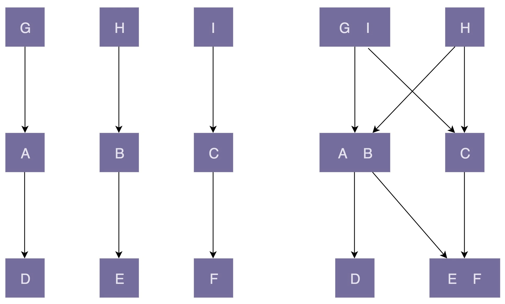

# 1.高内聚、松耦合

“高内聚、松耦合”是一个非常重要的设计思想，能够有效地提高代码的可读性和可维护性，缩小功能改动导致的代码改动范围。很多设计原则都以实现代码的“高内聚、松耦合”为目的，比如单一职责原则、基于接口而非实现编程等。

“高内聚”用来指导类本身的设计，“松耦合”用来指导类与类之间依赖关系的设计。

## 1.1 高内聚

所谓高内聚，就是指相近的功能应该放到同一个类中，不相近的功能不要放到同一个类中。相近的功能往往会被同时修改，放到同一个类中，修改会比较集中，代码容易维护。实际上，单一职责原则是实现代码高内聚非常有效的设计原则。

## 1.2 松耦合

松耦合是说，在代码中，类与类之间的依赖关系简单清晰。即使两个类有依赖关系，一个类的代码改动不会或者很少导致依赖类的代码改动。实际上，依赖注入、接口隔离、基于接口而非实现编程，以及迪米特法则，都是为了实现代码的松耦合。

## 1.3 “内聚”和“耦合”之间的关系。

“高内聚”有助于“松耦合”，同理，“低内聚”也会导致“紧耦合”。关于这一点，我画了一张对比图来解释。图中左边部分的代码结构是“高内聚、松耦合”；右边部分正好相反，是“低内聚、紧耦合”。

# 2. 迪米特法则

## 2.1 定义

迪米特法则的英文翻译是：Law of Demeter，缩写是 LOD不过，它还有另外一个更加达意的名字，叫作最小知识原则，英文翻译为：The Least Knowledge Principle。

英文定义：

> Each unit should have only limited knowledge about other units: only units “closely” related to the current unit. Or: Each unit should only talk to its friends; Don’t talk to strangers.

理解：**不该有直接依赖关系的类之间，不要有依赖；有依赖关系的类之间，尽量只依赖必要的接口（也就是定义中的“有限知识”）**。

不该有直接依赖关系的类之间，不要有依赖；有依赖关系的类之间，尽量只依赖必要的接口。迪米特法则是希望减少类之间的耦合，让类越独立越好。每个类都应该少了解系统的其他部分。一旦发生变化，需要了解这一变化的类就会比较少。

## 2.2 迪米特法则的优点

迪米特法则要求限制软件实体之间通信的宽度和深度，正确使用迪米特法则将有以下两个优点。

- 降低了类之间的耦合度，提高了模块的相对独立性。
- 由于亲合度降低，从而提高了类的可复用率和系统的扩展性。

但是，**过度使用迪米特法则会使系统产生大量的中介类，从而增加系统的复杂性，使模块之间的通信效率降低**。所以，在釆用迪米特法则时需要反复权衡，确保高内聚和低耦合的同时，保证系统的结构清晰。

## 2.3 迪米特法则的实现方法

从迪米特法则的定义和特点可知，它强调以下两点：

- 从依赖者的角度来说，只依赖应该依赖的对象。
- 从被依赖者的角度说，只暴露应该暴露的方法。

所以，在运用迪米特法则时要注意以下 6 点。

- 在类的划分上，应该**创建弱耦合的类**。类与类之间的耦合越弱，就越有利于实现可复用的目标。
- 在类的结构设计上，**尽量降低类成员的访问权限**。
- 在类的设计上，优先考虑将一个类设置成不变类。
- 在对其他类的引用上，将引用其他对象的次数降到最低。
- 不暴露类的属性成员，而应该提供相应的访问器（set 和 get     方法）。
- 谨慎使用序列化（`Serializable`）功能。