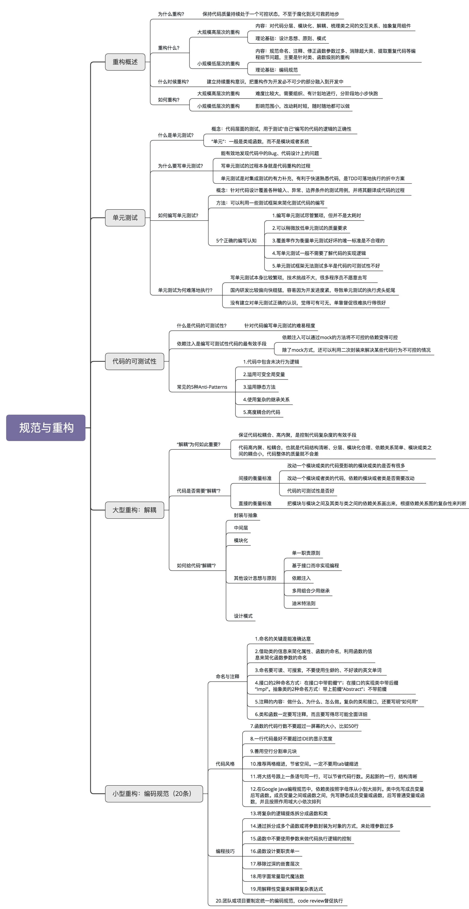

### 1. 重构概述

**重构的目的：为什么重构（why）？**

对于项目来言，重构可以保持代码质量持续处于一个可控状态，不至于腐化到无可救药的地步。对于个人而言，重构非常锻炼一个人的代码能力，并且是一件非常有成就感的事情。它是我们学习的经典设计思想、原则、模式、编程规范等理论知识的练兵场。

**重构的对象：重构什么（what）？**

按照重构的规模，可以将重构大致分为大规模高层次的重构和小规模低层次的重构。大规模高层次重构包括对代码分层、模块化、解耦、梳理类之间的交互关系、抽象复用组件等等。这部分工作利用的更多的是比较抽象、比较顶层的设计思想、原则、模式。小规模低层次的重构包括规范命名、注释、修正函数参数过多、消除超大类、提取重复代码等编程细节问题，主要是针对类、函数级别的重构。小规模低层次的重构更多的是利用编码规范这一理论知识。

**重构的时机：什么时候重构（when）？**

反复强调，一定要建立持续重构意识，把重构作为开发必不可少的部分融入到开发中，而不是等到代码出现很大问题的时候，再大刀阔斧地重构。

**重构的方法：如何重构（how）？**

大规模高层次的重构难度比较大，需要有组织、有计划地进行，分阶段地小步快跑，时刻保持代码处于一个可运行的状态。而小规模低层次的重构，因为影响范围小，改动耗时短，所以，只要你愿意并且有时间，随时随地都可以去做。

### 2. 单元测试

**什么是单元测试？**

单元测试是代码层面的测试，用于测试“自己”编写的代码的逻辑正确性。单元测试顾名思义是测试一个“单元”，这个“单元”一般是类或函数，而不是模块或者系统。

**为什么要写单元测试？**

单元测试能有效地发现代码中的 Bug、代码设计上的问题。写单元测试的过程本身就是代码重构的过程。单元测试是对集成测试的有力补充，能帮助我们快速熟悉代码，是 TDD 可落地执行的折中方案。

**如何编写单元测试？**

写单元测试就是针对代码设计覆盖各种输入、异常、边界条件的测试用例，并将其翻译成代码的过程。我们可以利用一些测试框架来简化测试代码的编写。对于单元测试，需要建立以下正确的认知：

- 编写单元测试尽管繁琐，但并不是太耗时；
- 可以稍微放低单元测试的质量要求；
- 覆盖率作为衡量单元测试好坏的唯一标准是不合理的；
- 写单元测试一般不需要了解代码的实现逻辑；
- 单元测试框架无法测试多半是代码的可测试性不好。

**单元测试为何难落地执行？**

一方面，写单元测试本身比较繁琐，技术挑战不大，很多程序员不愿意去写。另一方面，国内研发比较偏向“快糙猛”，容易因为开发进度紧，导致单元测试的执行虎头蛇尾，最后，没有建立对单元测试的正确认识，觉得可有可无，单靠督促很难执行得很好。

### 3. 代码的可测试性

**什么是代码的可测试性？**

粗略地讲，所谓代码的可测试性，就是针对代码编写单元测试的难易程度。对于一段代码，如果很难为其编写单元测试，或者单元测试写起来很费劲，需要依靠单元测试框架很高级的特性，那往往就意味着代码设计得不够合理，代码的可测试性不好。

**编写可测试性代码的最有效手段**

依赖注入是编写可测试性代码的最有效手段。通过依赖注入，在编写单元测试代码的时候，可以通过 mock 的方法将不可控的依赖变得可控，这也是在编写单元测试的过程中最有技术挑战的地方。除了 mock 方式，还可以利用二次封装来解决某些代码行为不可控的情况。

**常见的 Anti-Patterns**

典型的、常见的测试不友好的代码有下面这 5 种：

1. 代码中包含未决行为逻辑；
2. 滥用可变全局变量；
3. 滥用静态方法；
4. 使用复杂的继承关系；
5. 高度耦合的代码。

### 4. 大型重构：解耦

**“解耦”为何如此重要？**

过于复杂的代码往往在可读性、可维护性上都不友好。解耦，保证代码松耦合、高内聚，是控制代码复杂度的有效手段。如果代码高内聚、松耦合，也就是意味着，代码结构清晰、分层、模块化合理、依赖关系简单、模块或类之间的耦合小，那代码整体的质量就不会差。

**代码是否需要“解耦”？**

间接的衡量标准有很多，比如：改动一个模块或类的代码受影响的模块或类是否有很多、改动一个模块或者类的代码依赖的模块或者类是否需要改动、代码的可测试性是否好等等。直接的衡量标准是把模块与模块之间及其类与类之间的依赖关系画出来，根据依赖关系图的复杂性来判断是否需要解耦重构。

**如何给代码“解耦”？**

给代码解耦的方法有：封装与抽象、中间层、模块化，以及一些其他的设计思想与原则，比如：单一职责原则、基于接口而非实现编程、依赖注入、多用组合少用继承、迪米特法则。当然，还有一些设计模式，比如观察者模式。

### 5. 小型重构：编码规范

前面我们讲了很多设计原则，后面还会讲到很多设计模式，利用好它们都可以有效地改善代码的质量。但是，这些知识的合理应用非常依赖个人经验，有时候用不好会适得其反。但是编码规范正好相反，大部分都简单明了，在代码的细节方面，能立竿见影地改善质量。除此之外，前面也讲到，持续低层次小规模重构依赖的基本上都是这些编码规范，也是改善代码可读性的有效手段。

根据自己的开发经验，总结罗列了 20 条我认为最应该关注、最好用的编码规范，分为三个大的方面：命名与注释（Naming and Comments）、代码风格（Code Style）、编程技巧（Coding Tips）。

**命名与注释**

- 命名的关键是能准确的达意。对于不同作用域的命名，可以适当的选择不同的长度，作用域小的命名，比如临时变量等，可以适当的选择短一些的命名方式。除此之外，命名中个也可以使用一些耳熟能详的缩写。
- 借助类的信息来简化属性、函数的命名，利用函数的信息来简化函数参数的命名。
- 命名要可读、可搜索。不要使用生僻的、不好读的英文单词来命名。除此之外，命名要符合项目的统一规范，也不要用些反直觉的命名。
- 接口有两种命名方式。一种是在接口中带前缀"I"，另一种是在接口的实现类中带后缀“Impl”。两种命名方式都可以，关键是要在项目中统一。对于抽象类的命名，更倾向于带有前缀“Abstract”。
- 注释的目的就是让代码更容易看懂，只要符合这个要求，你就可以写。总结一下的话，注释主要包含这样三个方面的内容：做什么、为什么、怎么做。对于一些复杂的类和接口，可能还需要写明“如何用”。
- 注释本身有一定的维护成本，所以并非越多越好。类和函数一定要写注释，而且要写的尽可能全面详细些，而函数内部的注释会相对少一些，一般都是靠好的命名和提炼函数、解释性变量、总结性注释来做到代码易读。

**代码风格**

代码风格都没有对错和优劣之分，不同的编程语言风格都不太一样，只要能在团队、项目中统一即可，不过，最好能跟业内推荐的风格、开源项目的代码风格相一致。所以，这里就不展开罗列了，你可以对照着自己熟悉的编程语言的代码风格，自己复习一下。

**编程技巧**

- 将复杂的逻辑提炼拆分成函数和类；
- 通过拆分成多个函数的方式来处理参数过多的情况；
- 通过将参数封装为对象来处理参数过多的情况；
- 函数中不要使用参数来做代码执行逻辑的控制；
- 移除过深的嵌套层次，方法包括：去掉多余的 if 或 else 语句，使用 continue、break、return 关键字提前退出嵌套，调整执行顺序来减少嵌套，将部分嵌套逻辑抽象成函数；
- 用字面常量取代魔法数；
- 利用解释性变量来解释复杂表达式。

**统一编码规范**

除了细节的知识点之外，最后，还有一条非常重要的，那就是，项目、团队，甚至公司，一定要制定统一的编码规范，并且通过 Code Review 督促执行，这对提高代码质量有立竿见影的效果。

