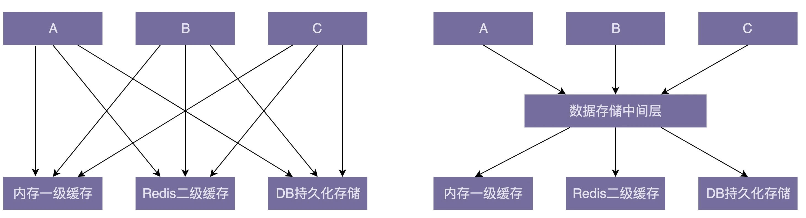

对于大型重构来说，最有效的一个手段，那就是“解耦”。解耦的目的是实现代码高内聚、松耦合。

# 1.“解耦”为何如此重要？

如果说重构是保证代码质量不至于腐化到无可救药地步的有效手段，那么利用解耦的方法对代码重构，就是保证代码不至于复杂到无法控制的有效手段。

“高内聚、松耦合”是一个比较通用的设计思想，不仅可以指导细粒度的类和类之间关系的设计，还能指导粗粒度的系统、架构、模块的设计。相对于编码规范，它能够在更高层次上提高代码的可读性和可维护性。

“高内聚、松耦合”的特性可以聚焦在某一模块或类中，不需要了解太多其他模块或类的代码，让我们的焦点不至于过于发散，降低了阅读和修改代码的难度

代码高内聚、松耦合，也就是意味着，代码结构清晰、分层模块化合理、依赖关系简单、模块或类之间的耦合小，那代码整体的质量就不会差。即便某个具体的类或者模块设计得不怎么合理，代码质量不怎么高，影响的范围是非常有限的。

# 2. 代码是否需要“解耦”？

间接的衡量标准有很多，比如，看修改代码是否牵一发而动全身。直接的衡量标准是把模块与模块、类与类之间的依赖关系画出来，根据依赖关系图的复杂性来判断是否需要解耦重构。

如果依赖关系复杂、混乱，那从代码结构上来讲，可读性和可维护性肯定不是太好，那我们就需要考虑是否可以通过解耦的方法，让依赖关系变得清晰、简单。

# 3. 如何给代码“解耦”？

给代码解耦的方法有：封装与抽象、中间层、模块化，以及一些其他的设计思想与原则，比如：单一职责原则、基于接口而非实现编程、依赖注入、多用组合少用继承、迪米特法则等。当然，还有一些设计模式，比如观察者模式。

## 3.1 封装与抽象

封装和抽象作为两个非常通用的设计思想，可以应用在很多设计场景中，比如系统、模块、lib、组件、接口、类等等的设计。**封装和抽象可以有效地隐藏实现的复杂性，隔离实现的易变性，给依赖的模块提供稳定且易用的抽象接口**。

## 3.2 中间层

引入中间层能简化模块或类之间的依赖关系。下面这张图是引入中间层前后的依赖关系对比图。在引入数据存储中间层之前，A、B、C 三个模块都要依赖内存一级缓存、Redis 二级缓存、DB 持久化存储三个模块。在引入中间层之后，三个模块只需要依赖数据存储一个模块即可。从图上可以看出，中间层的引入明显地简化了依赖关系，让代码结构更加清晰。

除此之外，在进行重构的时候，引入中间层可以起到过渡的作用，能够让开发和重构同步进行，不互相干扰。

为了让重构能小步快跑，可以分下面四个阶段来完成接口的修改。

- 第一阶段：引入一个中间层，包裹老的接口，提供新的接口定义。
- 第二阶段：新开发的代码依赖中间层提供的新接口。
- 第三阶段：将依赖老接口的代码改为调用新接口。
- 第四阶段：确保所有的代码都调用新接口之后，删除掉老的接口。

这样，每个阶段的开发工作量都不会很大，都可以在很短的时间内完成。重构跟开发冲突的概率也变小了。

## 3.3 模块化

模块化是构建复杂系统常用的手段。很多大型软件（比如 Windows）之所以能做到几百、上千人有条不紊地协作开发，也归功于模块化做得好。不同的模块之间通过 API 来进行通信，每个模块之间耦合很小，每个小的团队聚焦于一个独立的高内聚模块来开发，最终像搭积木一样将各个模块组装起来，构建成一个超级复杂的系统。

合理地划分模块能有效地解耦代码，提高代码的可读性和可维护性。所以，在开发代码的时候，一定要有模块化意识，将每个模块都当作一个独立的 lib 一样来开发，只提供封装了内部实现细节的接口给其他模块使用，这样可以减少不同模块之间的耦合度。

## 3.4 其他设计思想和原则

“高内聚、松耦合”是一个非常重要的设计思想，能够有效提高代码的可读性和可维护性，缩小功能改动导致的代码改动范围。很多设计原则都以实现代码的“高内聚、松耦合”为目的。来一块总结回顾一下都有哪些原则。

### （1）单一职责原则

内聚性和耦合性并非独立的。高内聚会让代码更加松耦合，而实现高内聚的重要指导原则就是单一职责原则。模块或者类的职责设计得单一，而不是大而全，那依赖它的类和它依赖的类就会比较少，代码耦合也就相应的降低了。

### （2）基于接口而非实现编程

基于接口而非实现编程能通过接口这样一个中间层，隔离变化和具体的实现。这样做的好处是，在有依赖关系的两个模块或类之间，一个模块或者类的改动，不会影响到另一个模块或类。实际上，这就相当于将一种强依赖关系（强耦合）解耦为了弱依赖关系（弱耦合）。

### （3）依赖注入

跟基于接口而非实现编程思想类似，依赖注入也是将代码之间的强耦合变为弱耦合。尽管依赖注入无法将本应该有依赖关系的两个类，解耦为没有依赖关系，但可以让耦合关系没那么紧密，容易做到插拔替换。

### （4）多用组合少用继承

继承是一种强依赖关系，父类与子类高度耦合，且这种耦合关系非常脆弱，牵一发而动全身，父类的每一次改动都会影响所有的子类。相反，组合关系是一种弱依赖关系，这种关系更加灵活，所以，对于继承结构比较复杂的代码，利用组合来替换继承，也是一种解耦的有效手段。

### （5）迪米特法则

迪米特法则讲的是，不该有直接依赖关系的类之间，不要有依赖；有依赖关系的类之间，尽量只依赖必要的接口。从定义上，可以看出，这条原则的目的就是为了实现代码的松耦合。

除了上面的这些设计思想和原则之外，还有一些设计模式也是为了解耦依赖，比如观察者模式。