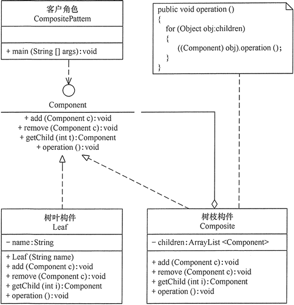
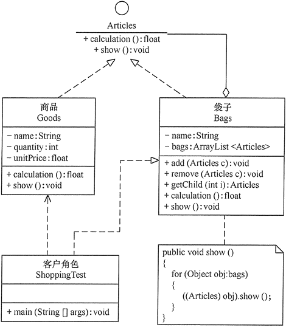

组合模式跟我们之前讲的面向对象设计中的“组合关系（通过组合来组装两个类）”，完全是两码事。这里讲的“组合模式”，主要是用来处理树形结构数据。这里的“数据”，可以简单理解为一组对象集合。

在现实生活中，存在很多“**部分-整体**”的关系，例如，大学中的部门与学院、总公司中的部门与分公司、学习用品中的书与书包、生活用品中的衣月艮与衣柜以及厨房中的锅碗瓢盆等。

在软件开发中也是这样，例如，文件系统中的文件与文件夹、窗体程序中的简单控件与容器控件等。**对这些简单对象与复合对象的处理，如果用组合模式来实现会很方便**。

# 1.组合模式定义

在 GoF 的《设计模式》一书中，组合模式是这样定义的：

Compose objects into tree structure to represent part-whole hierarchies.Composite lets client treat individual objects and compositions of objects uniformly.

翻译成中文就是：将一组对象组织（Compose）成树形结构，以表示一种“部分 - 整体”的层次结构。组合让客户端（在很多设计模式书籍中，“客户端”代指代码的使用者。）可以统一单个对象和组合对象的处理逻辑。

有时又叫作**部分-整体**模式，它是一种**将对象组合成树状的层次结构的模式**，用来表示“部分-整体”的关系，使用户对单个对象和组合对象具有一致的访问性。

实际上，刚才讲的这种组合模式的设计思路，与其说是一种设计模式，倒不如说是对业务场景的一种数据结构和算法的抽象。其中，数据可以表示成树这种数据结构，业务需求可以通过在树上的递归遍历算法来实现。

组合模式，将一组对象组织成树形结构，将单个对象和组合对象都看做树中的节点，以统一处理逻辑，并且它利用树形结构的特点，递归地处理每个子树，依次简化代码实现。使用组合模式的前提在于，你的业务场景必须能够表示成树形结构。所以，组合模式的应用场景也比较局限，它并不是一种很常用的设计模式。

# 2.组合模式的特点

## 2.1 优点

- 组合模式使得客户端代码可以一致地处理单个对象和组合对象，无须关心自己处理的是单个对象，还是组合对象，这简化了客户端代码。
- 更容易在组合体内加入新的对象，客户端不会因为加入了新的对象而更改源代码，满足“开闭原则”。

## 2.2 缺点

- 设计较复杂，客户端需要花更多时间理清类之间的层次关系。
- 不容易限制容器中的构件。
- 不容易用继承的方法来增加构件的新功能。

## 2.3 应用场景

- 在需要表示一个**对象整体与部分的层次结构**的场合。
- 要求对**用户隐藏组合对象与单个对象的不同，用户可以用统一的接口使用组合结构中**的所有对象的场合。

# 3.组合模式实现

## 3.1 主要角色

组合模式包含以下主要角色

- **抽象构件（Component）角色**：它的主要作用是为树叶构件和树枝构件声明公共接口，并实现它们的默认行为。在透明式的组合模式中抽象构件还声明访问和管理子类的接口；在安全式的组合模式中不声明访问和管理子类的接口，管理工作由树枝构件完成。

- **树叶构件（Leaf）角色**：是组合中的叶节点对象，它没有子节点，用于实现抽象构件角色中 声明的公共接口。

- **树枝构件（Composite）角色**：是组合中的分支节点对象，它有子节点。它实现了抽象构件角色中声明的接口，它的主要作用是存储和管理子部件，通常包含 Add()、Remove()、GetChild() 等方法。

## 3.2 分类

组合模式分为**透明式的组合模式和安全式的组合**模式

### （1）透明方式

在该方式中，由于**抽象构件声明了所有子类中的全部方法，所以客户端无须区别树叶对象和树枝对象，对客户端来说是透明的**。但其缺点是：树叶构件本来没有 Add()、Remove() 及 GetChild() 方法，却要实现它们（空实现或抛异常），这样会带来一些安全性问题。其结构图如图所示。

### （2）安全方式

在该方式中，**将管理子构件的方法移到树枝构件中，抽象构件和树叶构件没有对子对象的管理方法**，这样就避免了上一种方式的安全性问题，但由于叶子和分支有不同的接口，客户端在调用时要知道树叶对象和树枝对象的存在，所以失去了透明性。其结构图如图所示。

# 4.示例

用组合模式实现当用户在商店购物后，显示其所选商品信息，并计算所选商品总价的功能。

说明：假如李先生到“天街e角”生活用品店购物，用 1 个红色小袋子装了 2 包特产（单价 7.9 元）、1 张地图（单价 9.9 元）；用 1 个白色小袋子装了 2 包香菇（单价 68 元）和 3 包红茶（单价 180 元）；用 1 个中袋子装了前面的红色小袋子和 1 个景德镇瓷器（单价 380 元）；用 1 个大袋子装了前面的中袋子、白色小袋子和 1 双李宁牌运动鞋（单价 198 元）。

最后“大袋子”中的内容有：{1 双李宁牌运动鞋（单价 198 元）、白色小袋子{2 包香菇（单价 68 元）、3 包红茶（单价 180 元）}、中袋子{1 个景德镇瓷器（单价 380 元）、红色小袋子{2 包特产（单价 7.9 元）、1 张地图（单价 9.9 元）}}}，现在要求编程显示李先生放在大袋子中的所有商品信息并计算要支付的总价。

