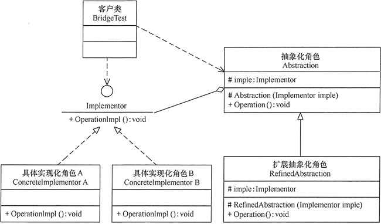
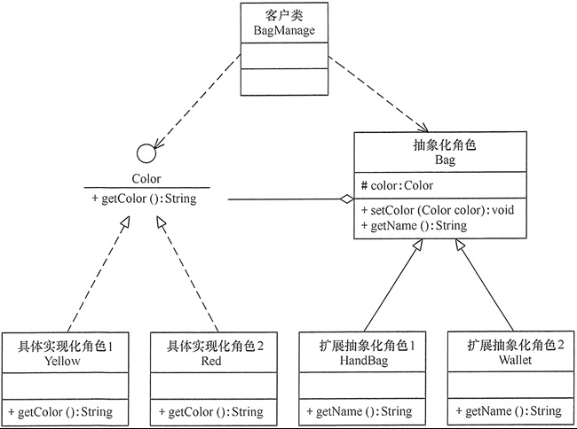

某些类**具有两个或多个维度的变化**，如图形既可按形状分，又可按颜色分。如何设计类似于 Photoshop 这样的软件，能画不同形状和不同颜色的图形呢？如果用继承方式，m 种形状和 n 种颜色的图形就有 m×n 种，不但对应的子类很多，而且扩展困难。

这样的例子还有很多，如不同颜色和字体的文字、不同品牌和功率的汽车、不同性别和职业的男女、支持不同平台和不同文件格式的媒体播放器等。如果用桥接模式就能很好地解决这些问题。

# 1.桥接模式定义

将**抽象与实现分离**，使它们可以独立变化。它是**用组合关系代替继承关系来实现，从而降低了抽象和实现这两个可变维度的耦合度**。

对于桥接模式有两种不同的理解方式。在 GoF 的《设计模式》一书中，桥接模式被定义为：“将抽象和实现解耦，让它们可以独立变化。”在其他资料和书籍中，还有另外一种更加简单的理解方式：“一个类存在两个（或多个）独立变化的维度，我们通过组合的方式，让这两个（或多个）维度可以独立进行扩展。”

对于第一种 GoF 的理解方式，弄懂定义中“抽象”和“实现”两个概念，是理解它的关键。定义中的“抽象”，指的并非“抽象类”或“接口”，而是被抽象出来的一套“类库”，它只包含骨架代码，真正的业务逻辑需要委派给定义中的“实现”来完成。而定义中的“实现”，也并非“接口的实现类”，而是一套独立的“类库”。“抽象”和“实现”独立开发，通过对象之间的组合关系，组装在一起。

对于第二种理解方式，它非常类似“组合优于继承”设计原则，通过组合关系来替代继承关系，避免继承层次的指数级爆炸。

# 2.桥接模式的特点

## 2.1 优点

- 由于抽象与实现分离，所以扩展能力强。
- 其实现细节对客户透明。

## 2.2 缺点

- 由于聚合关系建立在抽象层，要求开发者针对抽象化进行设计与编程，这增加了系统的理解与设计难度。

## 2.3 应用场景

- 当**一个类存在两个独立变化的维度，且这两个维度都需要进行扩展时**。
- 当一个系统不希望使用继承或因为多层次继承导致系统类的个数急剧增加时。
- 当一个系统需要在构件的抽象化角色和具体化角色之间增加更多的灵活性时。

# 3.桥接模式实现

桥接模式包含以下主要角色

- **抽象化（Abstraction）角色**：定义抽象类，并包含一个对实现化对象的引用。
- **扩展抽象化（Refined Abstraction）角色**：是抽象化角色的子类，实现父类中的业务方法，并通过组合关系调用实现化角色中的业务方法。
- **实现化（Implementor）角色**：定义实现化角色的接口，供扩展抽象化角色调用。
- **具体实现化（Concrete Implementor）角色**：给出实现化角色接口的具体实现。

UML图如下所示：

# 4.示例

用桥接（Bridge）模式模拟女士皮包的选购。

女士皮包有很多种，可以按用途分、按皮质分、按品牌分、按颜色分、按大小分等，存在多个维度的变化，所以采用桥接模式来实现女士皮包的选购比较合适。

本实例按用途分可选钱包（Wallet）和挎包（HandBag），按颜色分可选黄色（Yellow）和红色（Red）。可以按两个维度定义为颜色类和包类。

颜色类（Color）是一个维度，定义为实现化角色，它有两个具体实现化角色：黄色和红色，通过 getColor() 方法可以选择颜色；包类（Bag）是另一个维度，定义为抽象化角色，它有两个扩展抽象化角色：挎包和钱包，它包含了颜色类对象，通过 getName() 方法可以选择相关颜色的挎包和钱包。

