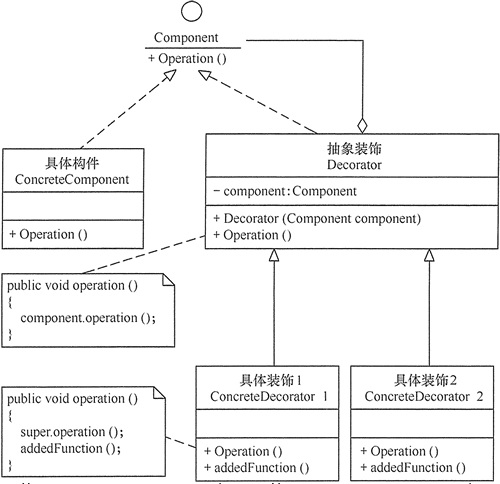
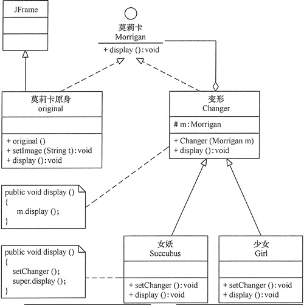

在现实生活中，常常**需要对现有产品增加新的功能或美化其外观**，如房子装修、相片加相框等。

在软件开发过程中，有时想用一些现存的组件。这些组件可能只是完成了一些核心功能。但在**不改变其结构的情况下，可以动态地扩展其功能**。所有这些都可以釆用装饰模式来实现。

# 1.装饰模式定义

指**在不改变现有对象结构的情况下，动态地给该对象增加一些职责**（即增加其额外功能）的模式，它属于对象结构型模式。

装饰器模式主要解决继承关系过于复杂的问题，通过组合来替代继承。它主要的作用是给原始类添加增强功能。这也是判断是否该用装饰器模式的一个重要的依据。除此之外，装饰器模式还有一个特点，那就是可以对原始类嵌套使用多个装饰器。为了满足这个应用场景，在设计的时候，装饰器类需要跟原始类继承相同的抽象类或者接口。

# 2.装饰模式的特点

## 2.1 优点

- 采用装饰模式扩展对象的功能比采用继承方式更加灵活。
- 可以设计出多个不同的具体装饰类，创造出多个不同行为的组合。

## 2.2 缺点

- 装饰模式增加了许多子类，如果过度使用会使程序变得很复杂。

## 2.3 应用场景

- 当需要给一个**现有类添加附加职责，而又不能采用生成子类的方法进行扩充时**。例如，该类被隐藏或者该类是终极类或者采用继承方式会产生大量的子类。
- 当需要通过对**现有的一组基本功能进行排列组合而产生非常多的功能时，采用继承关系很难实现**，而采用装饰模式却很好实现。
- 当对象的功能要求可以动态地添加，也可以再动态地撤销时。

# 3.装饰模式实现

通常情况下，**扩展**一个类的功能会使用**继承**方式来实现。但**继承具有静态特征，耦合度高，并且随着扩展功能的增多，子类会很膨胀**。如果使用组合关系来创建一个包装对象（即装饰对象）来包裹真实对象，并在保持真实对象的类结构不变的前提下，为其提供额外的功能，这就是装饰模式的目标。

装饰模式包含以下主要角色

- **抽象构件（Component）角色**：定义一个抽象接口以规范准备接收附加责任的对象。
- **具体构件（Concrete Component）角色**：实现抽象构件，通过装饰角色为其添加一些职责。
- **抽象装饰（Decorator）角色**：继承抽象构件，并包含具体构件的实例，可以通过其子类扩展具体构件的功能。
- **具体装饰（ConcreteDecorator）角色**：实现抽象装饰的相关方法，并给具体构件对象添加附加的责任。

UML图如下所示：

# 4.示例

用装饰模式实现游戏角色“莫莉卡·安斯兰”的变身。

在《恶魔战士》中，游戏角色“莫莉卡·安斯兰”的原身是一个可爱少女，但当她变身时，会变成头顶及背部延伸出蝙蝠状飞翼的女妖，当然她还可以变为穿着漂亮外衣的少女。这些都可用装饰模式来实现，在本实例中的“莫莉卡”原身有 set_image(String t) 方法决定其显示方式，而其 变身“蝙蝠状女妖”和“着装少女”可以用 set_changer() 方法来改变其外观，原身与变身后的效果用 display() 方法来显示。

