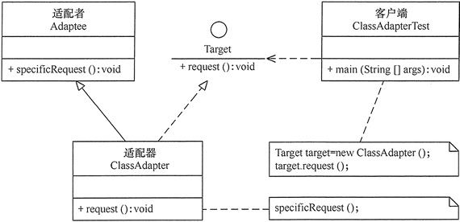
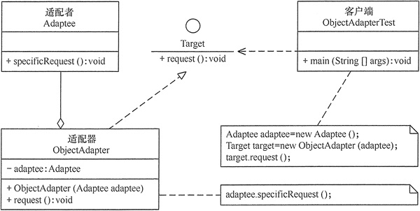
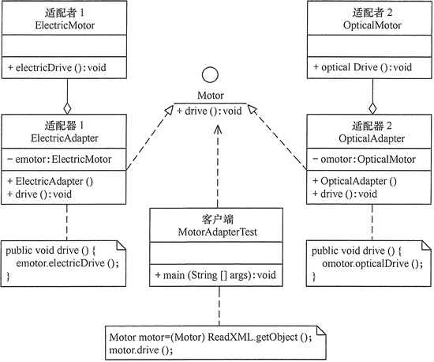

在现实生活中，经常出现**两个对象因接口不兼容而不能在一起工作的实例**，这时需要第三者进行适配。

在软件设计中也可能出现：**需要开发的具有某种业务功能的组件在现有的组件库中已经存在，但它们与当前系统的接口规范不兼容**，如果重新开发这些组件成本又很高，这时用适配器模式能很好地解决这些问题。

# 1.适配器模式定义

**将一个类的接口转换成客户希望的另外一个接口**，使得原本由于接口不兼容而不能一起工作的那些类能一起工作。

适配器模式有两种实现方式：**类适配器和对象适配器**。其中，类适配器使用继承关系来实现，对象适配器使用组合关系来实现。

类适配器UML如下图：

对象适配器UML如下图：

# 2.适配器模式的特点

## 2.1 优点

- 客户端通过适配器可以透明地调用目标接口。
- 复用了现存的类，程序员不需要修改原有代码而重用现有的适配者类。
- 将目标类和适配者类解耦，解决了目标类和适配者类接口不一致的问题。

## 2.2 缺点

- 对类适配器来说，更换适配器的实现过程比较复杂。

## 2.3 应用场景

### （1）封装有缺陷的接口设计

假设依赖的外部系统在接口设计方面有缺陷（比如包含大量静态方法），引入之后会影响到自身代码的可测试性。为了隔离设计上的缺陷，希望对外部系统提供的接口进行二次封装，抽象出更好的接口设计

### （2）统一多个类的接口设计

某个功能的实现依赖多个外部系统（或者说类）。通过适配器模式，将它们的接口适配为统一的接口定义，然后就可以使用多态的特性来复用代码逻辑。

### （3）替换依赖的外部系统

当把项目中依赖的一个外部系统替换为另一个外部系统的时候，利用适配器模式，可以减少对代码的改动

### （4）兼容老版本接口

对于一些要废弃的接口，不直接将其删除，而是暂时保留，并且标注为 deprecated，并将内部实现逻辑委托为新的接口实现。

### （5）适配不同格式的数据

适配器模式主要用于接口的适配，实际上，它还可以用在不同格式的数据之间的适配。比如，把从不同征信系统拉取的不同格式的征信数据，统一为相同的格式，以方便存储和使用。

# 3.适配器模式实现

类适配器模式可采用**多重继承方式实现**。

**对象适配器模式可釆用将现有组件库中已经实现的组件引入适配器类中**，该类同时实现当前系统的业务接口。现在来介绍它们的基本结构。

适配器模式包含以下主要角色

- **目标（Target）接口**：当前系统业务所期待的接口，它可以是抽象类或接口。
- **适配者（Adaptee）类**：它是被访问和适配的现存组件库中的组件接口。
- **适配器（Adapter）类**：它是一个转换器，通过继承或引用适配者的对象，把适配者接口转换成目标接口，让客户按目标接口的格式访问适配者。

# 4.示例

用适配器模式（Adapter）模拟新能源汽车的发动机

新能源汽车的发动机有电能发动机（Electric Motor）和光能发动机（Optical Motor）等，各种发动机的驱动方法不同，例如，电能发动机的驱动方法 electric_drive() 是用电能驱动，而光能发动机的驱动方法 opticalDrive() 是用光能驱动，它们是适配器模式中被访问的适配者。

客户端希望用统一的发动机驱动方法 drive() 访问这两种发动机，所以必须定义一个统一的目标接口 Motor，然后再定义电能适配器（Electric Adapter）和光能适配器（Optical Adapter）去适配这两种发动机。

UML图如下：

