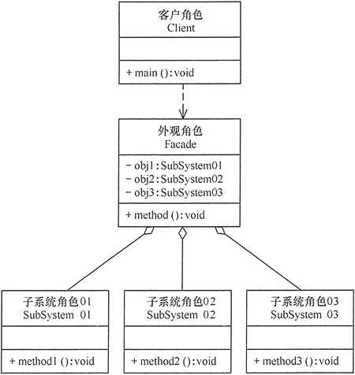

在现实生活中，**常常存在办事较复杂的例子，如办房产证或注册一家公司，有时要同多个部门联系，这时要是有一个综合部门能解决一切手续问题就好了**。

软件设计也是这样，**当一个系统的功能越来越强，子系统会越来越多，客户对系统的访问也变得越来越复杂。这时如果系统内部发生改变，客户端也要跟着改变**，这违背了“开闭原则”，也违背了“迪米特法则”，所以有必要为多个子系统提供一个统一的接口，从而降低系统的耦合度，这就是外观模式的目标。

# 1.外观模式定义

外观模式，英文全称是 Facade Design Pattern。在 GoF 的《设计模式》一书中，门面模式是这样定义的：

Provide a unified interface to a set of interfaces in a subsystem. Facade Pattern defines a higher-level interface that makes the subsystem easier to use.

翻译成中文就是：门面模式为子系统提供一组统一的接口，定义一组高层接口让子系统更易用。

**一种通过为多个复杂的子系统提供一个一致的接口，而使这些子系统更加容易被访问的模式**。

该模式**对外有一个统一接口**，外部应用程序不用关心内部子系统的具体的细节，这样会大大降低应用程序的复杂度，提高了程序的可维护性。

外观（Facade）模式是“迪米特法则”的典型应用。

# 2.外观模式的特点

## 2.1 优点

- 降低了子系统与客户端之间的耦合度，使得子系统的变化不会影响调用它的客户类。
- 对客户屏蔽了子系统组件，减少了客户处理的对象数目，并使得子系统使用起来更加容易。
- 降低了大型软件系统中的编译依赖性，简化了系统在不同平台之间的移植过程，因为编译一个子系统不会影响其他的子系统，也不会影响外观对象。

## 2.2 缺点

- 不能很好地限制客户使用子系统类。
- 增加新的子系统可能需要修改外观类或客户端的源代码，违背了“开闭原则”。

## 2.3 应用场景

### （1）解决易用性问题

外观模式可以用来封装系统的底层实现，隐藏系统的复杂性，提供一组更加简单易用、更高层的接口。

### （2）解决性能问题

如果外观接口不多，完全可以将它跟非外观接口放到一块，也不需要特殊标记，当作普通接口来用即可。如果外观接口很多，可以在已有的接口之上，再重新抽象出一层，专门放置外观接口，从类、包的命名上跟原来的接口层做区分。如果外观接口特别多，并且很多都是跨多个子系统的，可以将外观接口放到一个新的子系统中。

### （3）解决分布式事务问题

支持两个接口调用在一个事务中执行，是比较难实现的，这涉及分布式事务问题。虽然可以通过引入分布式事务框架或者事后补偿的机制来解决，但代码实现都比较复杂。而最简单的解决方案是，利用数据库事务，在一个事务中，执行创建用户和创建钱包这两个 SQL 操作。这就要求两个 SQL 操作要在一个接口中完成，所以，可以借鉴外观模式的思想，再设计一个包裹这两个操作的新接口，让新接口在一个事务中执行两个 SQL 操作。

# 3.适配器 VS 外观模式

- 适配器主要是为了解决接口不兼容的问题，而门面模式主要用于设计接口的易用性问题。
- 适配器在代码结构上主要是继承加组合，门面模式在代码结构上主要是封装。
- 适配器可以看作是事后行为，是一种“补偿模式”，主要是用来完善设计上的不足，而门面模式是在设计接口时就需要考虑的，是一种事前行为。

# 4.外观模式实现

外观（Facade）模式的结构比较简单，**主要是定义了一个高层接口**。它包含了对各个子系统的引用，客户端可以通过它访问各个子系统的功能。现在来分析其基本结构和实现方法

外观模式包含以下主要角色

- **外观（Facade）角色**：为多个子系统对外提供一个共同的接口。
- **子系统（Sub System）角色**：实现系统的部分功能，客户可以通过外观角色访问它。
- **客户（Client）角色**：通过一个外观角色访问各个子系统的功能。

UML图如下所示：

