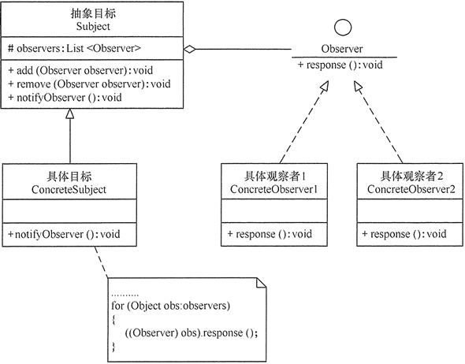
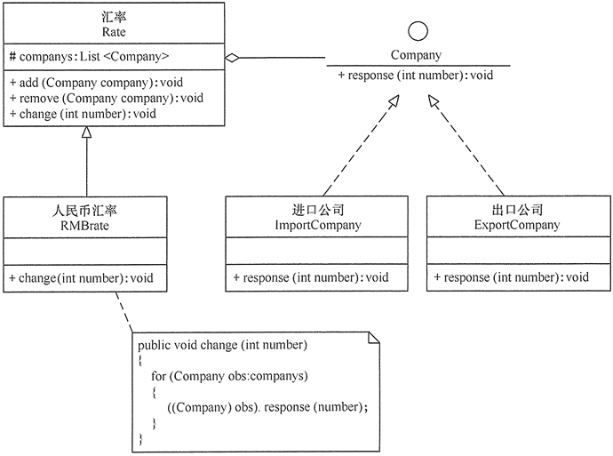

创建型设计模式主要解决“对象的创建”问题，结构型设计模式主要解决“类或对象的组合或组装”问题，那行为型设计模式主要解决的就是“类或对象之间的交互”问题。

设计模式要干的事情就是解耦，创建型模式是将创建和使用代码解耦，结构型模式是将不同功能代码解耦，行为型模式是将不同的行为代码解耦，具体到观察者模式，它将观察者和被观察者代码解耦。借助设计模式，我们利用更好的代码结构，将一大坨代码拆分成职责更单一的小类，让其满足开闭原则、高内聚低耦合等特性，以此来控制和应对代码的复杂性，提高代码的可扩展性。

在现实世界中，**许多对象并不是独立存在的，其中一个对象的行为发生改变可能会导致一个或者多个其他对象的行为也发生改变**。例如，某种商品的物价上涨时会导致部分商家高兴，而消费者伤心；还有，当我们开车到交叉路口时，遇到红灯会停，遇到绿灯会行。这样的例子还有很多，例如，股票价格与股民、微信公众号与微信用户、气象局的天气预报与听众、小偷与警察等。

在软件世界也是这样，例如，Excel 中的数据与折线图、饼状图、柱状图之间的关系；MVC 模式中的模型与视图的关系；事件模型中的事件源与事件处理者。所有这些，如果用观察者模式来实现就非常方便。

# 1.观察者模式定义

**观察者模式**（Observer Design Pattern）也被称为**发布订阅模式**（Publish-Subscribe Design Pattern）。

指**多个对象间存在一对多的依赖关系，当一个对象的状态发生改变时，所有依赖于它的对象都得到通知并被自动更新**。这种模式有时又称作发布-订阅模式、模型-视图模式，它是对象行为型模式。

在 GoF 的《设计模式》一书中，它的定义是这样的：

Define a one-to-many dependency between objects so that when one object changes state, all its dependents are notified and updated automatically.

翻译成中文就是：在对象之间定义一个一对多的依赖，当一个对象状态改变的时候，所有依赖的对象都会自动收到通知。

一般情况下，被依赖的对象叫作**被观察者**（Observable），依赖的对象叫作**观察者**（Observer）。不过，在实际的项目开发中，这两种对象的称呼是比较灵活的，有各种不同的叫法，比如：Subject-Observer、Publisher-Subscriber、Producer-Consumer、EventEmitter-EventListener、Dispatcher-Listener。不管怎么称呼，只要应用场景符合刚刚给出的定义，都可以看作观察者模式。

# 2.观察者模式的特点

## 2.1 优点

- 降低了目标与观察者之间的耦合关系，两者之间是抽象耦合关系
- 目标与观察者之间建立了一套触发机制

## 2.2 缺点

- 目标与观察者之间的依赖关系并没有完全解除，而且有可能出现循环引用
- 当观察者对象很多时，通知的发布会花费很多时间，影响程序的效率

## 2.3 应用场景

- 对象间存在一对多关系，一个对象的状态发生改变会影响其他对象。
- 当一个抽象模型有两个方面，其中一个方面依赖于另一方面时，可将这二者封装在独立的对象中以使它们可以各自独立地改变和复用。

# 3.观察者模式实现

观察者模式的应用场景非常广泛，小到代码层面的解耦，大到架构层面的系统解耦，再或者一些产品的设计思路，都有这种模式的影子，比如，邮件订阅、RSS Feeds，本质上都是观察者模式。不同的应用场景和需求下，这个模式也有截然不同的实现方式，有同步阻塞的实现方式，也有异步非阻塞的实现方式；有进程内的实现方式，也有跨进程的实现方式。

- **抽象主题（Subject）角色**：也叫抽象目标类，它提供了一个用于保存观察者对象的聚集类和增加、删除观察者对象的方法，以及通知所有观察者的抽象方法。
- **具体主题（Concrete Subject）角色**：也叫具体目标类，它实现抽象目标中的通知方法，当具体主题的内部状态发生改变时，通知所有注册过的观察者对象。
- **抽象观察者（Observer）角色**：它是一个抽象类或接口，它包含了一个更新自己的抽象方法，当接到具体主题的更改通知时被调用。
- **具体观察者（Concrete Observer）角色**：实现抽象观察者中定义的抽象方法，以便在得到目标的更改通知时更新自身的状态。

观察者模式的结构图如图所示

# 4.示例

利用观察者模式设计一个程序，分析“人民币汇率”的升值或贬值对进口公司的进口产品成本或出口公司的出口产品收入以及公司的利润率的影响。

分析：当“人民币汇率”升值时，进口公司的进口产品成本降低且利润率提升，出口公司的出口产品收入降低且利润率降低；当“人民币汇率”贬值时，进口公司的进口产品成本提升且利润率降低，出口公司的出口产品收入提升且利润率提升。

这里的汇率（Rate）类是抽象目标类，它包含了保存观察者（Company）的 List 和增加/删除观察者的方法，以及有关汇率改变的抽象方法 change(int number)；而人民币汇率（RMBrate）类是具体目标， 它实现了父类的 change(int number) 方法，即当人民币汇率发生改变时通过相关公司；公司（Company）类是抽象观察者，它定义了一个有关汇率反应的抽象方法 response(int number)；进口公司（ImportCompany）类和出口公司（ExportCompany）类是具体观察者类，它们实现了父类的 response(int number) 方法，即当它们接收到汇率发生改变的通知时作为相应的反应。如图所示是其结构图。

