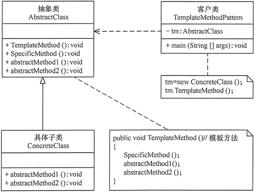
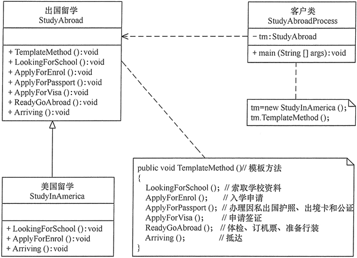

在面向对象程序设计过程中，程序员常常会遇到这种情况：**设计一个系统时知道了算法所需的关键步骤，而且确定了这些步骤的执行顺序，但某些步骤的具体实现还未知，或者说某些步骤的实现与具体的环境相关。**

例如，去银行办理业务一般要经过以下4个流程：取号、排队、办理具体业务、对银行工作人员进行评分等，其中取号、排队和对银行工作人员进行评分的业务对每个客户是一样的，可以在父类中实现，但是办理具体业务却因人而异，它可能是存款、取款或者转账等，可以延迟到子类中实现。

# 1.模板方法模式定义

模板模式，全称是模板方法设计模式，英文是 Template Method Design Pattern。

定义一个操作中的**算法骨架**，而将算法的一些步骤延迟到子类中，使得**子类可以不改变该算法结构的情况下重定义该算法的某些特定步骤**。它是一种类行为型模式。

在 GoF 的《设计模式》一书中，它是这么定义的：

Define the skeleton of an algorithm in an operation, deferring some steps to subclasses. Template Method lets subclasses redefine certain steps of an algorithm without changing the algorithm’s structure.

翻译成中文就是：模板方法模式在一个方法中定义一个算法骨架，并将某些步骤推迟到子类中实现。模板方法模式可以让子类在不改变算法整体结构的情况下，重新定义算法中的某些步骤。

这里的“算法”，我们可以理解为广义上的“业务逻辑”，并不特指数据结构和算法中的“算法”。这里的算法骨架就是“模板”，包含算法骨架的方法就是“模板方法”，这也是模板方法模式名字的由来。

# 2.模板方法模式的特点

## 2.1 优点

- 它封装了不变部分，扩展可变部分。它把认为是不变部分的算法封装到父类中实现，而把可变部分算法由子类继承实现，便于子类继续扩展。
- 它在父类中提取了公共的部分代码，便于代码复用。
- 部分方法是由子类实现的，因此子类可以通过扩展方式增加相应的功能，符合开闭原则。

## 2.2 缺点

- 对每个不同的实现都需要定义一个子类，这会导致类的个数增加，系统更加庞大，设计也更加抽象。
- 父类中的抽象方法由子类实现，子类执行的结果会影响父类的结果，这导致一种反向的控制结构，它提高了代码阅读的难度。

## 2.3 应用场景

- 算法的整体步骤很固定，但其中个别部分易变时，这时候可以使用模板方法模式，将容易变的部分抽象出来，供子类实现。
- 复用：当多个子类存在公共的行为时，可以将其提取出来并集中到一个公共父类中以避免代码重复。首先，要识别现有代码中的不同之处，并且将不同之处分离为新的操作。最后，用一个调用这些新的操作的模板方法来替换这些不同的代码。
- 扩展：当需要控制子类的扩展时，模板方法只在特定点调用钩子操作，这样就只允许在这些点进行扩展。

# 3.模板方法模式实现

模板方法模式包含以下主要角色

- **抽象类（Abstract Class）**：负责给出一个算法的轮廓和骨架。它由一个模板方法和若干个基本方法构成。这些方法的定义如下。
   - **模板方法**：定义了算法的骨架，按某种顺序调用其包含的基本方法。
   - **基本方法**：是整个算法中的一个步骤，包含以下几种类型。
     - **抽象方法**：在抽象类中申明，由具体子类实现；
     - **具体方法**：在抽象类中已经实现，在具体子类中可以继承或重写它；
     - **钩子方法**：在抽象类中已经实现，包括用于判断的逻辑方法和需要子类重写的空方法两种。
- **具体子类（Concrete Class）**：实现抽象类中所定义的抽象方法和钩子方法，它们是一个顶级逻辑的一个组成步骤。

模板方法模式的结构图如图所示

# 4.示例

用模板方法模式实现出国留学手续设计程序。

分析：出国留学手续一般经过以下流程：索取学校资料，提出入学申请，办理因私出国护照、出境卡和公证，申请签证，体检、订机票、准备行装，抵达目标学校等，其中有些业务对各个学校是一样的，但有些业务因学校不同而不同，所以比较适合用模板方法模式来实现。

在本实例中，我们先定义一个出国留学的抽象类 StudyAbroad，里面包含了一个模板方法 TemplateMethod()，该方法中包含了办理出国留学手续流程中的各个基本方法，其中有些方法的处理由于各国都一样，所以在抽象类中就可以实现，但有些方法的处理各国是不同的，必须在其具体子类（如美国留学类 StudyInAmerica）中实现。如果再增加一个国家，只要增加一个子类就可以了，如图所示是其结构图。

# 5.模板模式 VS 回调

从应用场景上来看，同步回调跟模板模式几乎一致。它们都是在一个大的算法骨架中，自由替换其中的某个步骤，起到代码复用和扩展的目的。而异步回调跟模板模式有较大差别，更像是观察者模式。

从代码实现上来看，回调和模板模式完全不同。回调基于组合关系来实现，把一个对象传递给另一个对象，是一种对象之间的关系；模板模式基于继承关系来实现，子类重写父类的抽象方法，是一种类之间的关系。

组合优于继承。实际上，这里也不例外。在代码实现上，回调相对于模板模式会更加灵活，主要体现在下面几点。

- 像 Java 这种只支持单继承的语言，基于模板模式编写的子类，已经继承了一个父类，不再具有继承的能力。
- 回调可以使用匿名类来创建回调对象，可以不用事先定义类；而模板模式针对不同的实现都要定义不同的子类。
- 如果某个类中定义了多个模板方法，每个方法都有对应的抽象方法，那即便我们只用到其中的一个模板方法，子类也必须实现所有的抽象方法。而回调就更加灵活，只需要往用到的模板方法中注入回调对象即可。