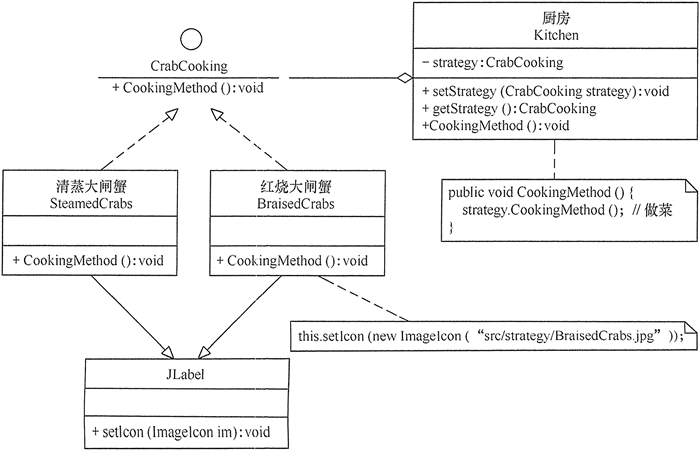

在现实生活中常常遇到**实现某种目标存在多种策略可供选择的情况**，例如，出行旅游可以乘坐飞机、乘坐火车、骑自行车或自己开私家车等，超市促销可以釆用打折、送商品、送积分等方法。

在软件开发中也常常遇到类似的情况，当**实现某一个功能存在多种算法或者策略**，可以根据环境或者条件的不同选择不同的算法或者策略来完成该功能，如数据排序策略有冒泡排序、选择排序、插入排序、二叉树排序等。

# 1.策略模式定义

策略模式，英文全称是 Strategy Design Pattern。

该模式**定义了一系列算法，并将每个算法封装起来，使它们可以相互替换，且算法的变化不会影响使用算法的客户**。策略模式属于对象行为模式，它通过对算法进行封装，把使用算法的责任和算法的实现分割开来，并委派给不同的对象对这些算法进行管理。

在 GoF 的《设计模式》一书中，它是这样定义的：

Define a family of algorithms, encapsulate each one, and make them interchangeable. Strategy lets the algorithm vary independently from clients that use it.

翻译成中文就是：定义一族算法类，将每个算法分别封装起来，让它们可以互相替换。策略模式可以使算法的变化独立于使用它们的客户端（这里的客户端代指使用算法的代码）

# 2.策略模式的特点

## 2.1 优点

- 多重条件语句不易维护，而使用策略模式可以避免使用多重条件语句。
- 策略模式提供了一系列的可供重用的算法族，恰当使用继承可以把算法族的公共代码转移到父类里面，从而避免重复的代码。
- 策略模式可以提供相同行为的不同实现，客户可以根据不同时间或空间要求选择不同的。
- 策略模式提供了对开闭原则的完美支持，可以在不修改原代码的情况下，灵活增加新算法。
- 策略模式把算法的使用放到环境类中，而算法的实现移到具体策略类中，实现了二者的分离。

## 2.2 缺点

- 客户端必须理解所有策略算法的区别，以便适时选择恰当的算法类。
- 策略模式造成很多的策略类。

## 2.3 应用场景

- 一个系统需要动态地在几种算法中选择一种时，可将每个算法封装到策略类中。
- 一个类定义了多种行为，并且这些行为在这个类的操作中以多个条件语句的形式出现，可将每个条件分支移入它们各自的策略类中以代替这些条件语句。
- 系统中各算法彼此完全独立，且要求对客户隐藏具体算法的实现细节时。
- 系统要求使用算法的客户不应该知道其操作的数据时，可使用策略模式来隐藏与算法相关的数据结构。
- 多个类只区别在表现行为不同，可以使用策略模式，在运行时动态选择具体要执行的行为。

# 3.策略模式实现

策略模式是**准备一组算法，并将这组算法封装到一系列的策略类里面，作为一个抽象策略类的子类**。策略模式的重心不是如何实现算法，而是如何组织这些算法，从而让程序结构更加灵活，具有更好的维护性和扩展性，现在我们来分析其基本结构和实现方法。

- **抽象策略（Strategy）类**：定义了一个公共接口，各种不同的算法以不同的方式实现这个接口，环境角色使用这个接口调用不同的算法，一般使用接口或抽象类实现。
- **具体策略（Concrete Strategy）类**：实现了抽象策略定义的接口，提供具体的算法实现。
- **环境（Context）类**：持有一个策略类的引用，最终给客户端调用。

策略模式的结构图如图所示


# 4.示例

策略模式在“大闸蟹”做菜中的应用。

分析：关于大闸蟹的做法有很多种，我们以清蒸大闸蟹和红烧大闸蟹两种方法为例，介绍策略模式的应用。

首先，定义一个大闸蟹加工的抽象策略类（CrabCooking），里面包含了一个做菜的抽象方法 CookingMethod()；然后，定义清蒸大闸蟹（SteamedCrabs）和红烧大闸蟹（BraisedCrabs）的具体策略类，它们实现了抽象策略类中的抽象方法；由于本程序要显示做好的结果图，所以，定义一个厨房（Kitchen）环境类，它具有设置和选择做菜策略的方法；客户类通过厨房类获取做菜策略，并把做菜结果显示出来，下图所示是其结构图。



# 5.扩展：策略工厂

一个完整的策略模式就是由这三个部分组成的。

- 策略类的定义比较简单，包含一个策略接口和一组实现这个接口的策略类。
- 策略的创建由工厂类来完成，封装策略创建的细节。
- 策略模式包含一组策略可选，客户端代码如何选择使用哪个策略，有两种确定方法：编译时静态确定和运行时动态确定。其中，“运行时动态确定”才是策略模式最典型的应用场景。

利用策略模式避免分支

```java
public class OrderService {
  public double discount(Order order) {
    double discount = 0.0;
    OrderType type = order.getType();
    if (type.equals(OrderType.NORMAL)) { // 普通订单
      //...省略折扣计算算法代码
    } else if (type.equals(OrderType.GROUPON)) { // 团购订单
      //...省略折扣计算算法代码
    } else if (type.equals(OrderType.PROMOTION)) { // 促销订单
      //...省略折扣计算算法代码
    }
    return discount;
  }
}
```

使用策略模式对上面的代码重构，将不同类型订单的打折策略设计成策略类，并由工厂类来负责创建策略对象。

```java
// 策略的定义
public interface DiscountStrategy {
  double calDiscount(Order order);
}
// 省略NormalDiscountStrategy、GrouponDiscountStrategy、PromotionDiscountStrategy类代码...
// 策略的创建
public class DiscountStrategyFactory {
  private static final Map<OrderType, DiscountStrategy> strategies = new HashMap<>();
  static {
    strategies.put(OrderType.NORMAL, new NormalDiscountStrategy());
    strategies.put(OrderType.GROUPON, new GrouponDiscountStrategy());
    strategies.put(OrderType.PROMOTION, new PromotionDiscountStrategy());
  }
  public static DiscountStrategy getDiscountStrategy(OrderType type) {
    return strategies.get(type);
  }
}
// 策略的使用
public class OrderService {
  public double discount(Order order) {
    OrderType type = order.getType();
    DiscountStrategy discountStrategy = DiscountStrategyFactory.getDiscountStrategy(type);
    return discountStrategy.calDiscount(order);
  }
}
```

重构之后的代码就没有了 if-else 分支判断语句了。实际上，这得益于策略工厂类。在工厂类中，我们用 Map 来缓存策略，根据 type 直接从 Map 中获取对应的策略，从而避免 if-else 分支判断逻辑。

