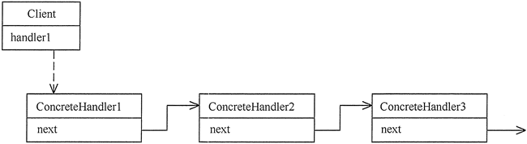
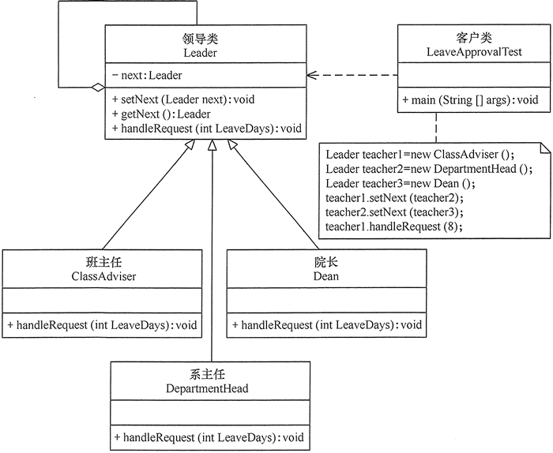

在现实生活中，常常会出现这样的事例：**一个请求有多个对象可以处理，但每个对象的处理条件或权限不同。**例如，公司员工请假，可批假的领导有部门负责人、副总经理、总经理等，但每个领导能批准的天数不同，员工必须根据自己要请假的天数去找不同的领导签名，也就是说员工必须记住每个领导的姓名、电话和地址等信息，这增加了难度。这样的例子还有很多，如找领导出差报销、生活中的“击鼓传花”游戏等。

在计算机软硬件中也有相关例子，如总线网中数据报传送，每台计算机根据目标地址是否同自己的地址相同来决定是否接收；还有异常处理中，处理程序根据异常的类型决定自己是否处理该异常；还有 Struts2 的拦截器、JSP 和 Servlet 的 Filter 等，所有这些，如果用责任链模式都能很好解决。

# 1、责任链模式定义

职责链模式的英文翻译是 Chain Of Responsibility Design Pattern。

**为了避免请求发送者与多个请求处理者耦合在一起，将所有请求的处理者通过前一对象记住其下一个对象的引用而连成一条链；当有请求发生时，可将请求沿着这条链传递，直到有对象处理它为止**。

在**责任链模式中，客户只需要将请求发送到责任链上即可，无须关心请求的处理细节和请求的传递过程**，所以责任链将请求的发送者和请求的处理者解耦了。

在 GoF 的《设计模式》中，它是这么定义的：

Avoid coupling the sender of a request to its receiver by giving more than one object a chance to handle the request. Chain the receiving objects and pass the request along the chain until an object handles it.

翻译成中文就是：将请求的发送和接收解耦，让多个接收对象都有机会处理这个请求。将这些接收对象串成一条链，并沿着这条链传递这个请求，直到链上的某个接收对象能够处理它为止。

# 2.责任链模式的特点

## 2.1 优点

- 降低了对象之间的耦合度。该模式使得一个对象无须知道到底是哪一个对象处理其请求以及链的结构，发送者和接收者也无须拥有对方的明确信息。
- 增强了系统的可扩展性。可以根据需要增加新的请求处理类，满足开闭原则。
- 增强了给对象指派职责的灵活性。当工作流程发生变化，可以动态地改变链内的成员或者调动它们的次序，也可动态地新增或者删除责任。
- 责任链简化了对象之间的连接。每个对象只需保持一个指向其后继者的引用，不需保持其他所有处理者的引用，这避免了使用众多的 if 或者 if···else 语句。
- 责任分担。每个类只需要处理自己该处理的工作，不该处理的传递给下一个对象完成，明确各类的责任范围，符合类的单一职责原则。

## 2.2 缺点

- 不能保证每个请求一定被处理。由于一个请求没有明确的接收者，所以不能保证它一定会被处理，该请求可能一直传到链的末端都得不到处理。
- 对比较长的职责链，请求的处理可能涉及多个处理对象，系统性能将受到一定影响。
- 职责链建立的合理性要靠客户端来保证，增加了客户端的复杂性，可能会由于职责链的错误设置而导致系统出错，如可能会造成循环调用。

## 2.3 应用场景

- 有多个对象可以处理一个请求，哪个对象处理该请求由运行时刻自动确定。
- 可动态指定一组对象处理请求，或添加新的处理者。
- 在不明确指定请求处理者的情况下，向多个处理者中的一个提交请求。

# 3.责任链模式实现

通常情况下，可以通过数据链表来实现职责链模式的数据结构。

- **抽象处理者（Handler）角色**：定义一个处理请求的接口，包含抽象处理方法和一个后继连接。
- **具体处理者（Concrete Handler）角色**：实现抽象处理者的处理方法，判断能否处理本次请求，如果可以处理请求则处理，否则将该请求转给它的后继者。
- **客户类（Client）角色**：创建处理链，并向链头的具体处理者对象提交请求，它不关心处理细节和请求的传递过程。

责任链模式的结构图如图所示

客户端可按如下图所示设置职责链

实际上，职责链模式还有一种变体，那就是请求会被所有的处理器都处理一遍，不存在中途终止的情况。这种变体也有两种实现方式：用链表存储处理器和用数组存储处理器，跟上面的实现方式类似，只需要稍微修改即可。

# 4.示例

用责任链模式设计一个请假条审批模块。

分析：假如规定学生请假小于或等于 2 天，班主任可以批准；小于或等于 7 天，系主任可以批准；小于或等于 10 天，院长可以批准；其他情况不予批准；这个实例适合使用职责链模式实现。

首先，定义一个领导类（Leader），它是抽象处理者，包含了一个指向下一位领导的指针 next 和一个处理假条的抽象处理方法 handleRequest(int LeaveDays)；然后，定义班主任类（ClassAdviser）、系主任类（DepartmentHead）和院长类（Dean），它们是抽象处理者的子类，是具体处理者，必须根据自己的权力去实现父类的 handleRequest(int LeaveDays) 方法，如果无权处理就将假条交给下一位具体处理者，直到最后；客户类负责创建处理链，并将假条交给链头的具体处理者（班主任）。如图所示是其结构图

