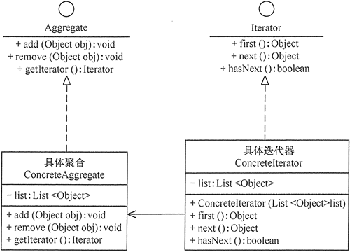

在现实生活以及程序设计中，**经常要访问一个聚合对象中的各个元素**，如“数据结构”中的链表遍历，通常的做法是将链表的创建和遍历都放在同一个类中，但这种方式不利于程序的扩展，如果要更换遍历方法就必须修改程序源代码，这违背了 “开闭原则”。

既然将遍历方法封装在聚合类中不可取，那么聚合类中不提供遍历方法，将遍历方法由用户自己实现是否可行呢？答案是同样不可取，因为这种方式会存在两个缺点：

- 暴露了聚合类的内部表示，使其数据不安全； 
- 增加了客户的负担。

“迭代器模式”能较好地克服以上缺点，它**在客户访问类与聚合类之间插入一个迭代器，这分离了聚合对象与其遍历行为**，对客户也隐藏了其内部细节，且满足“单一职责原则”和“开闭原则”。

# 1. 迭代器模式定义

迭代器模式（Iterator Design Pattern），也叫作游标模式（Cursor Design Pattern）

**提供一个对象来顺序访问聚合对象中的一系列数据，而不暴露聚合对象的内部表示**。

# 2.迭代器模式的特点

## 2.1 优点

- 访问一个聚合对象的内容而无须暴露它的内部表示;
- 遍历任务交由迭代器完成，这简化了聚合类；
- 它支持以不同方式遍历一个聚合，甚至可以自定义迭代器的子类以支持新的遍历；
- 增加新的聚合类和迭代器类都很方便，无须修改原有代码；
- 封装性良好，为遍历不同的聚合结构提供一个统一的接口.

## 2.2 缺点

- 增加了类的个数，这在一定程度上增加了系统的复杂性。

## 2.3 应用场景

- 当需要为聚合对象提供多种遍历方式时。
- 当需要为遍历不同的聚合结构提供一个统一的接口时。
- 当访问一个聚合对象的内容而无须暴露其内部细节的表示时。

由于聚合与迭代器的关系非常密切，所以大多数语言在实现聚合类时都提供了迭代器类，因此大数情况下使用语言中已有的聚合类的迭代器就已经够了。

# 3. 迭代器模式实现

- **抽象聚合（Aggregate）角色**：定义存储、添加、删除聚合对象以及创建迭代器对象的接口。
- **具体聚合（ConcreteAggregate）角色**：实现抽象聚合类，返回一个具体迭代器的实例。
- **抽象迭代器（Iterator）角色**：定义访问和遍历聚合元素的接口，通常包含 hasNext()、first()、next() 等方法。
- **具体迭代器（Concretelterator）角色**：实现抽象迭代器接口中所定义的方法，完成对聚合对象的遍历，记录遍历的当前位置。

迭代器模式的结构图如图所示

# 4.示例

实现上述迭代器