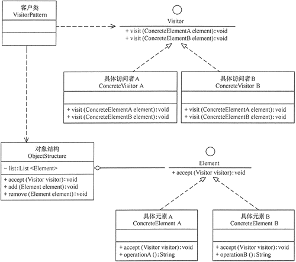
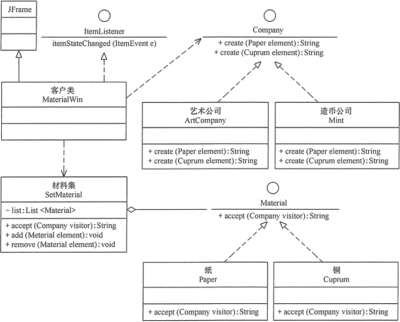

在现实生活中，**有些集合对象中存在多种不同的元素，且每种元素也存在多种不同的访问者和处理方式**。例如，公园中存在多个景点，也存在多个游客，不同的游客对同一个景点的评价可能不同；医院医生开的处方单中包含多种药元素，査看它的划价员和药房工作人员对它的处理方式也不同，划价员根据处方单上面的药品名和数量进行划价，药房工作人员根据处方单的内容进行抓药。

这样的例子还有很多，例如，电影或电视剧中的人物角色，不同的观众对他们的评价也不同；还有顾客在商场购物时放在“购物车”中的商品，顾客主要关心所选商品的性价比，而收银员关心的是商品的价格和数量。

这些被处理的**数据元素相对稳定而访问方式多种多样的数据结构**，如果用“访问者模式”来处理比较方便。访问者模式**能把处理方法从数据结构中分离出来，并可以根据需要增加新的处理方法，且不用修改原来的程序代码与数据结构**，这提高了程序的扩展性和灵活性。

# 1.访问者模式定义

访问者者模式的英文翻译是 Visitor Design Pattern。

将作用于**某种数据结构中的各元素的操作分离出来封装成独立的类**，使其在不改变数据结构的前提下可以添加作用于这些元素的新的操作，为数据结构中的每个元素提供多种访问方式。它将对数据的操作与数据结构进行分离，是行为类模式中最复杂的一种模式。

在 GoF 的《设计模式》一书中，它是这么定义的：

Allows for one or more operation to be applied to a set of objects at runtime, decoupling the operations from the object structure.

翻译成中文就是：允许一个或者多个操作应用到一组对象上，解耦操作和对象本身。

访问者模式允许一个或者多个操作应用到一组对象上，设计意图是解耦操作和对象本身，保持类职责单一、满足开闭原则以及应对代码的复杂性。

# 2.访问者模式的特点

## 2.1 优点

- **扩展性好**。能够在不修改对象结构中的元素的情况下，为对象结构中的元素添加新的功能。
- **复用性好**。可以通过访问者来定义整个对象结构通用的功能，从而提高系统的复用程度。
- **灵活性好**。访问者模式将数据结构与作用于结构上的操作解耦，使得操作集合可相对自由地演化而不影响系统的数据结构。
- **符合单一职责原则**。访问者模式把相关的行为封装在一起，构成一个访问者，使每一个访问者的功能都比较单一。

## 2.2 缺点

- **增加新的元素类很困难**。在访问者模式中，每增加一个新的元素类，都要在每一个具体访问者类中增加相应的具体操作，这违背了“开闭原则”。
- **破坏封装**。访问者模式中具体元素对访问者公布细节，这破坏了对象的封装性。
- **违反了依赖倒置原则**。访问者模式依赖了具体类，而没有依赖抽象类。

## 2.3 应用场景

- **对象结构相对稳定，但其操作算法经常变化的程序**。
- **对象结构中的对象需要提供多种不同且不相关的操作**，而且要避免让这些操作的变化影响对象的结构。
- **对象结构包含很多类型的对象**，希望对这些对象实施一些依赖于其具体类型的操作。

# 3. 访问者模式实现

- **抽象访问者（Visitor）角色**：定义一个访问具体元素的接口，为每个具体元素类对应一个访问操作 visit() ，该操作中的参数类型标识了被访问的具体元素。
- **具体访问者（ConcreteVisitor）角色**：实现抽象访问者角色中声明的各个访问操作，确定访问者访问一个元素时该做什么。
- **抽象元素（Element）角色**：声明一个包含接受操作 accept() 的接口，被接受的访问者对象作为 accept() 方法的参数。
- **具体元素（ConcreteElement）角色**：实现抽象元素角色提供的 accept() 操作，其方法体通常都是 visitor.visit(this) ，另外具体元素中可能还包含本身业务逻辑的相关操作。
- **对象结构（Object Structure）角色**：是一个包含元素角色的容器，提供让访问者对象遍历容器中的所有元素的方法，通常由 List、Set、Map 等聚合类实现。

访问者模式的结构图如图所示

## 4、示例

利用“访问者（Visitor）模式”模拟艺术公司与造币公司的功能。

分析：艺术公司利用“铜”可以设计出铜像，利用“纸”可以画出图画；造币公司利用“铜”可以印出铜币，利用“纸”可以印出纸币。对“铜”和“纸”这两种元素，两个公司的处理方法不同，所以该实例用访问者模式来实现比较适合。

首先，定义一个公司（Company）接口，它是抽象访问者，提供了两个根据纸（Paper）或铜（Cuprum）这两种元素创建作品的方法；再定义艺术公司（ArtCompany）类和造币公司（Mint）类，它们是具体访问者，实现了父接口的方法；然后，定义一个材料（Material）接口，它是抽象元素，提供了 accept（Company visitor）方法来接受访问者（Company）对象访问；再定义纸（Paper）类和铜（Cuprum）类，它们是具体元素类，实现了父接口中的方法；最后，定义一个材料集（SetMaterial）类，它是对象结构角色，拥有保存所有元素的容器 List，并提供让访问者对象遍历容器中的所有元素的 accept（Company visitor）方法；客户类提供材料集（SetMaterial）对象供访问者（Company）对象访问，实现了 ItemListener 接口，处理用户的事件请求。

