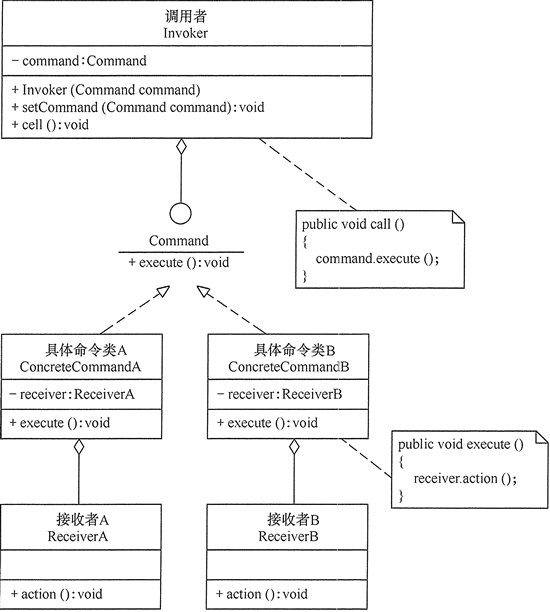
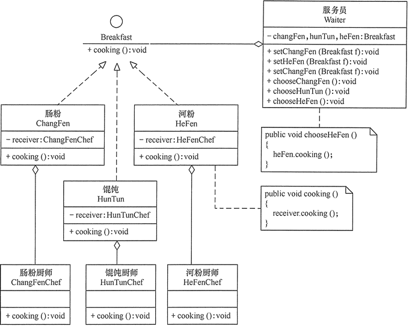

在软件开发系统中，**常常出现“方法的请求者”与“方法的实现者”之间存在紧密的耦合关系**。这不利于软件功能的扩展与维护。例如，想对行为进行“**撤销、重做、记录**”等处理都很不方便，因此“如何将方法的请求者与方法的实现者解耦？”变得很重要，命令模式能很好地解决这个问题。

在现实生活中，这样的例子也很多，例如，电视机遥控器（命令发送者）通过按钮（具体命令）来遥控电视机（命令接收者），还有计算机键盘上的“功能键”等。

# 1.命令模式定义

命令模式的英文翻译是 Command Design Pattern。

命令（Command）模式的定义如下：**将一个请求封装为一个对象，使发出请求的责任和执行请求的责任分割开**。这样两者之间通过命令对象进行沟通，这样方便将命令对象进行储存、传递、调用、增加与管理。

在 GoF 的《设计模式》一书中，它是这么定义的：

The command pattern encapsulates a request as an object, thereby letting us parameterize other objects with different requests, queue or log requests, and support undoable operations.

翻译成中文就是下面这样。命令模式将请求（命令）封装为一个对象，这样可以使用不同的请求参数化其他对象（将不同请求依赖注入到其他对象），并且能够支持请求（命令）的排队执行、记录日志、撤销等（附加控制）功能。

落实到编码实现，命令模式用到最核心的实现手段，就是将函数封装成对象。我们知道，在大部分编程语言中，函数是没法作为参数传递给其他函数的，也没法赋值给变量。借助命令模式，我们将函数封装成对象，这样就可以实现把函数像对象一样使用。

命令模式的主要作用和应用场景，是用来控制命令的执行，比如，异步、延迟、排队执行命令、撤销重做命令、存储命令、给命令记录日志等等，这才是命令模式能发挥独一无二作用的地方。

# 2.命令模式的特点

## 2.1 优点

- **降低系统的耦合度**。命令模式能将调用操作的对象与实现该操作的对象解耦。
- 增加或删除命令非常方便。采用命令模式增加与删除命令不会影响其他类，它满足“开闭原则”，对扩展比较灵活。
- 可以实现宏命令。命令模式可以与组合模式结合，将多个命令装配成一个组合命令，即宏命令。
- 方便实现 Undo 和 Redo 操作。命令模式可以与后面介绍的备忘录模式结合，实现命令的撤销与恢复。

## 2.2 缺点

- 可能产生大量具体命令类。因为计对每一个具体操作都需要设计一个具体命令类，这将增加系统的复杂性。

## 2.3 应用场景

- 当系统需要将请求调用者与请求接收者解耦时，命令模式使得调用者和接收者不直接交互。
- 当系统需要随机请求命令或经常增加或删除命令时，命令模式比较方便实现这些功能。
- 当系统需要执行一组操作时，命令模式可以定义宏命令来实现该功能。
- 当系统需要支持命令的撤销（Undo）操作和恢复（Redo）操作时，可以将命令对象存储起来，采用备忘录模式来实现。

# 3.命令模式实现

可以将系统中的相关操作抽象成命令，使调用者与实现者相关分离，其结构如下。

- **抽象命令类（Command）角色**：声明执行命令的接口，拥有执行命令的抽象方法 execute()。
- **具体命令角色（Concrete Command）角色**：是抽象命令类的具体实现类，它拥有接收者对象，并通过调用接收者的功能来完成命令要执行的操作。
- **实现者/接收者（Receiver）角色**：执行命令功能的相关操作，是具体命令对象业务的真正实现者。
- **调用者/请求者（Invoker）角色**：是请求的发送者，它通常拥有很多的命令对象，并通过访问命令对象来执行相关请求，它不直接访问接收者。

命令模式的结构图如图所示

# 4.示例

用命令模式实现客户去餐馆吃早餐的实例。

分析：客户去餐馆可选择的早餐有肠粉、河粉和馄饨等，客户可向服务员选择以上早餐中的若干种，服务员将客户的请求交给相关的厨师去做。这里的点早餐相当于“命令”，服务员相当于“调用者”，厨师相当于“接收者”，所以用命令模式实现比较合适。

首先，定义一个早餐类（Breakfast），它是抽象命令类，有抽象方法 cooking()，说明要做什么；再定义其子类肠粉类（ChangFen）、馄饨类（HunTun）和河粉类（HeFen），它们是具体命令类，实现早餐类的 cooking() 方法，但它们不会具体做，而是交给具体的厨师去做；具体厨师类有肠粉厨师（ChangFenChef）、馄蚀厨师（HunTunChef）和河粉厨师（HeFenChef），他们是命令的接收者，由于本实例要显示厨师做菜的效果图，所以把每个厨师类定义为 JFrame 的子类；最后，定义服务员类（Waiter），它接收客户的做菜请求，并发出做菜的命令。客户类是通过服务员类来点菜的，如图所示是其结构图。

