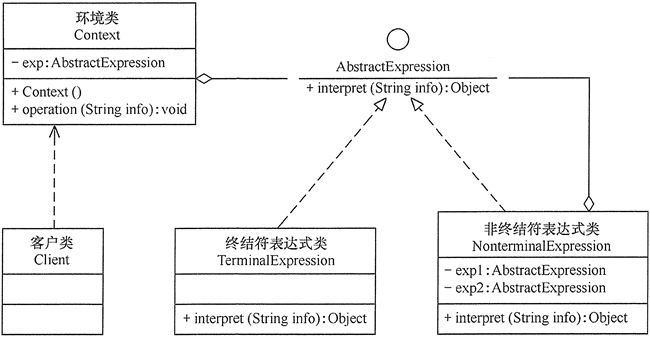

在软件开发中，会遇到**有些问题多次重复出现，而且有一定的相似性和规律性**。如果将它们归纳成一种简单的语言，那么这些问题实例将是该语言的一些句子，这样就可以用“编译原理”中的解释器模式来实现了。

虽然使用解释器模式的实例不是很多，但对于满足以上特点，且对运行效率要求不是很高的应用实例，如果用解释器模式来实现，其效果是非常好的。

# 1. 解释器模式定义

解释器模式的英文翻译是 Interpreter Design Pattern。

**给分析对象定义一个语言，并定义该语言的文法表示，再设计一个解析器来解释语言中的句子**。也就是说，用编译语言的方式来分析应用中的实例。这种模式实现了文法表达式处理的接口，该接口解释一个特定的上下文。

这里提到的文法和句子的概念同编译原理中的描述相同，“文法”指语言的语法规则，而“句子”是语言集中的元素。例如，汉语中的句子有很多，“我是中国人”是其中的一个句子，可以用一棵语法树来直观地描述语言中的句子。

在 GoF 的《设计模式》一书中，它是这样定义的：

Interpreter pattern is used to defines a grammatical representation for a language and provides an interpreter to deal with this grammar.

翻译成中文就是：解释器模式为某个语言定义它的语法（或者叫文法）表示，并定义一个解释器用来处理这个语法。

# 2. 解释器模式的特点

## 2.1 优点

- **扩展性好**。由于在解释器模式中使用类来表示语言的文法规则，因此可以通过继承等机制来改变或扩展文法。
- **容易实现**。在语法树中的每个表达式节点类都是相似的，所以实现其文法较为容易。

## 2.2 缺点

- **执行效率较低**。解释器模式中通常使用大量的循环和递归调用，当要解释的句子较复杂时，其运行速度很慢，且代码的调试过程也比较麻烦。
- **会引起类膨胀**。解释器模式中的每条规则至少需要定义一个类，当包含的文法规则很多时，类的个数将急剧增加，导致系统难以管理与维护。
- **可应用的场景比较少**。在软件开发中，需要定义语言文法的应用实例非常少，所以这种模式很少被使用到。

## 2.3 应用场景

- 当语言的文法较为简单，且执行效率不是关键问题时。
- 当问题重复出现，且可以用一种简单的语言来进行表达时。
- 当一个**语言需要解释执行**，并且语言中的句子可以表示为一个抽象语法树的时候，如 XML 文档解释。

注意：**解释器模式在实际的软件开发中使用比较少，因为它会引起效率、性能以及维护等问题**。

# 3. 解释器模式实现

解释器模式常用于对简单语言的编译或分析实例中，为了掌握好它的结构与实现，必须先了解编译原理中的“文法、句子、语法树”等相关概念。

## 3.1 文法

**文法是用于描述语言的语法结构的形式规则**。没有规矩不成方圆，例如，有些人认为完美爱情的准则是“相互吸引、感情专一、任何一方都没有恋爱经历”，虽然最后一条准则较苛刻，但任何事情都要有规则，语言也一样，不管它是机器语言还是自然语言，都有它自己的文法规则。例如，中文中的“句子”的文法如下。

```
〈句子〉::=〈主语〉〈谓语〉〈宾语〉
〈主语〉::=〈代词〉|〈名词〉
〈谓语〉::=〈动词〉
〈宾语〉::=〈代词〉|〈名词〉
〈代词〉你|我|他
〈名词〉7大学生I筱霞I英语
〈动词〉::=是|学习
```

注：**这里的符号“::=”表示“定义为”的意思，用“〈”和“〉”括住的是非终结符，没有括住的是终结符**。

## 3.2 句子

句子是语言的基本单位，是语言集中的一个元素，它由终结符构成，能由“文法”推导出。例如，上述文法可以推出“我是大学生”，所以它是句子。

## 3.3 语法树

语法树是句子结构的一种树型表示，它代表了句子的推导结果，它有利于理解句子语法结构的层次。如图所示是“我是大学生”的语法树。


有了以上基础知识，现在来介绍解释器模式的结构就简单了。解释器模式的结构与组合模式相似，不过其包含的组成元素比组合模式多，而且组合模式是对象结构型模式，而解释器模式是类行为型模式。

## 3.4 模式的结构

- **抽象表达式（Abstract Expression）角色**：定义解释器的接口，约定解释器的解释操作，主要包含解释方法 interpret()。
- **终结符表达式（Terminal Expression）角色**：是抽象表达式的子类，用来实现文法中与终结符相关的操作，文法中的每一个终结符都有一个具体终结表达式与之相对应。
- **非终结符表达式（Nonterminal Expression）角色**：也是抽象表达式的子类，用来实现文法中与非终结符相关的操作，文法中的每条规则都对应于一个非终结符表达式。
- **环境（Context）角色**：通常包含各个解释器需要的数据或是公共的功能，一般用来传递被所有解释器共享的数据，后面的解释器可以从这里获取这些值。
- **客户端（Client）**：主要任务是将需要分析的句子或表达式转换成使用解释器对象描述的抽象语法树，然后调用解释器的解释方法，当然也可以通过环境角色间接访问解释器的解释方法。

解释器模式的结构图如图所示



# 4.示例

用解释器模式实现四则运算。