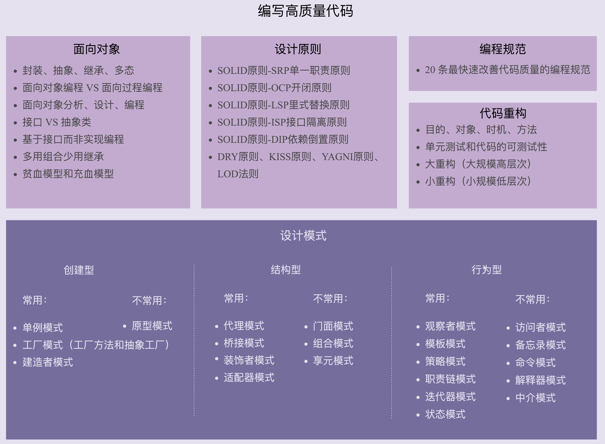

创建型设计模式包括：单例模式、工厂模式、建造者模式、原型模式。它主要解决对象的创建问题，封装复杂的创建过程，解耦对象的创建代码和使用代码。

### 1. 单例模式

单例模式用来创建全局唯一的对象。一个类只允许创建一个对象（或者叫实例），那这个类就是一个单例类，这种设计模式就叫作单例模式。单例有几种经典的实现方式，它们分别是：饿汉式、懒汉式、双重检测、静态内部类、枚举。

尽管单例是一个很常用的设计模式，在实际的开发中，也确实经常用到它，但是，有些人认为单例是一种反模式（anti-pattern），并不推荐使用，主要的理由有以下几点：

- 单例对 OOP 特性的支持不友好
- 单例会隐藏类之间的依赖关系
- 单例对代码的扩展性不友好
- 单例对代码的可测试性不友好
- 单例不支持有参数的构造函数

那有什么替代单例的解决方案呢？如果要完全解决这些问题，可能要从根上寻找其他方式来实现全局唯一类。比如，通过工厂模式、IOC 容器来保证全局唯一性。

有人把单例当作反模式，主张杜绝在项目中使用。我个人觉得这有点极端。模式本身没有对错，关键看你怎么用。如果单例类并没有后续扩展的需求，并且不依赖外部系统，那设计成单例类就没有太大问题。对于一些全局类，我们在其他地方 new 的话，还要在类之间传来传去，不如直接做成单例类，使用起来简洁方便。

除此之外，我们还讲到了进程唯一单例、线程唯一单例、集群唯一单例、多例等扩展知识点，这一部分在实际的开发中并不会被用到，但是可以扩展你的思路、锻炼你的逻辑思维。这里我就不带你回顾了，你可以自己回忆一下。

### 2. 工厂模式

工厂模式包括简单工厂、工厂方法、抽象工厂这 3 种细分模式。其中，简单工厂和工厂方法比较常用，抽象工厂的应用场景比较特殊，所以很少用到，不是我们学习的重点。

工厂模式用来创建不同但是相关类型的对象（继承同一父类或者接口的一组子类），由给定的参数来决定创建哪种类型的对象。实际上，如果创建对象的逻辑并不复杂，那我们直接通过 new 来创建对象就可以了，不需要使用工厂模式。当创建逻辑比较复杂，是一个“大工程”的时候，我们就考虑使用工厂模式，封装对象的创建过程，将对象的创建和使用相分离。

当每个对象的创建逻辑都比较简单的时候，我推荐使用简单工厂模式，将多个对象的创建逻辑放到一个工厂类中。当每个对象的创建逻辑都比较复杂的时候，为了避免设计一个过于庞大的工厂类，我们推荐使用工厂方法模式，将创建逻辑拆分得更细，每个对象的创建逻辑独立到各自的工厂类中。

详细点说，工厂模式的作用有下面 4 个，这也是判断要不要使用工厂模式最本质的参考标准。

- 封装变化：创建逻辑有可能变化，封装成工厂类之后，创建逻辑的变更对调用者透明。
- 代码复用：创建代码抽离到独立的工厂类之后可以复用。
- 隔离复杂性：封装复杂的创建逻辑，调用者无需了解如何创建对象。
- 控制复杂度：将创建代码抽离出来，让原本的函数或类职责更单一，代码更简洁。

除此之外，还讲了工厂模式一个非常经典的应用场景：依赖注入框架，比如 Spring IOC、Google Guice，它用来集中创建、组装、管理对象，跟具体业务代码解耦，让程序员聚焦在业务代码的开发上。DI 框架已经成为了我们平时开发的必备框架，在专栏中，我还带你实现了一个简单的 DI 框架，你可以再回过头去看看。

### 3. 建造者模式

建造者模式用来创建复杂对象，可以通过设置不同的可选参数，“定制化”地创建不同的对象。建造者模式的原理和实现比较简单，重点是掌握应用场景，避免过度使用。

如果一个类中有很多属性，为了避免构造函数的参数列表过长，影响代码的可读性和易用性，我们可以通过构造函数配合 set() 方法来解决。但是，如果存在下面情况中的任意一种，我们就要考虑使用建造者模式了。

- 把类的必填属性放到构造函数中，强制创建对象的时候就设置。如果必填的属性有很多，把这些必填属性都放到构造函数中设置，那构造函数就又会出现参数列表很长的问题。如果我们把必填属性通过 set() 方法设置，那校验这些必填属性是否已经填写的逻辑就无处安放了。
- 如果类的属性之间有一定的依赖关系或者约束条件，我们继续使用构造函数配合 set() 方法的设计思路，那这些依赖关系或约束条件的校验逻辑就无处安放了。
- 如果我们希望创建不可变对象，也就是说，对象在创建好之后，就不能再修改内部的属性值，要实现这个功能，我们就不能在类中暴露 set() 方法。构造函数配合 set() 方法来设置属性值的方式就不适用了。

### 4. 原型模式

如果对象的创建成本比较大，而同一个类的不同对象之间差别不大（大部分字段都相同），在这种情况下，我们可以利用对已有对象（原型）进行复制（或者叫拷贝）的方式，来创建新对象，以达到节省创建时间的目的。这种基于原型来创建对象的方式就叫作原型模式。

原型模式有两种实现方法，深拷贝和浅拷贝。浅拷贝只会复制对象中基本数据类型数据和引用对象的内存地址，不会递归地复制引用对象，以及引用对象的引用对象……而深拷贝得到的是一份完完全全独立的对象。所以，深拷贝比起浅拷贝来说，更加耗时，更加耗内存空间。

如果要拷贝的对象是不可变对象，浅拷贝共享不可变对象是没问题的，但对于可变对象来说，浅拷贝得到的对象和原始对象会共享部分数据，就有可能出现数据被修改的风险，也就变得复杂多了。操作非常耗时的情况下，我们比较推荐使用浅拷贝，否则，没有充分的理由，不要为了一点点的性能提升而使用浅拷贝。

