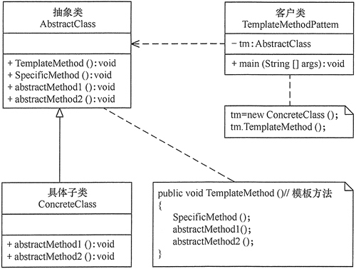
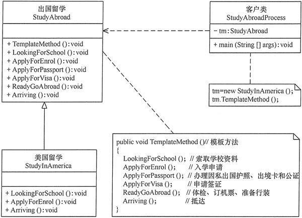

# 模板方法模式

在面向对象程序设计过程中，程序员常常会遇到这种情况：**设计一个系统时知道了算法所需的关键步骤，而且确定了这些步骤的执行顺序，但某些步骤的具体实现还未知，或者说某些步骤的实现与具体的环境相关。**

例如，去银行办理业务一般要经过以下4个流程：取号、排队、办理具体业务、对银行工作人员进行评分等，其中取号、排队和对银行工作人员进行评分的业务对每个客户是一样的，可以在父类中实现，但是办理具体业务却因人而异，它可能是存款、取款或者转账等，可以延迟到子类中实现。

## 1、模板方法模式定义

定义一个操作中的**算法骨架**，而将算法的一些步骤延迟到子类中，使得**子类可以不改变该算法结构的情况下重定义该算法的某些特定步骤**。它是一种类行为型模式。

## 2、模板方法模式的特点

### 模板方法模式具有以下优点：

> 它封装了不变部分，扩展可变部分。它把认为是不变部分的算法封装到父类中实现，而把可变部分算法由子类继承实现，便于子类继续扩展。
> 
> 它在父类中提取了公共的部分代码，便于代码复用。
> 
> 部分方法是由子类实现的，因此子类可以通过扩展方式增加相应的功能，符合开闭原则。
> 

### 模板方法模式的缺点是：

> 对每个不同的实现都需要定义一个子类，这会导致类的个数增加，系统更加庞大，设计也更加抽象。
>
> 父类中的抽象方法由子类实现，子类执行的结果会影响父类的结果，这导致一种反向的控制结构，它提高了代码阅读的难度。
>

### 应用场景

> 算法的整体步骤很固定，但其中个别部分易变时，这时候可以使用模板方法模式，将容易变的部分抽象出来，供子类实现。
>
> 当多个子类存在公共的行为时，可以将其提取出来并集中到一个公共父类中以避免代码重复。首先，要识别现有代码中的不同之处，并且将不同之处分离为新的操作。最后，用一个调用这些新的操作的模板方法来替换这些不同的代码。
>
> 当需要控制子类的扩展时，模板方法只在特定点调用钩子操作，这样就只允许在这些点进行扩展。
>

## 3、模板方法模式实现

模板方法模式包含以下主要角色

> **抽象类（Abstract Class）**：负责给出一个算法的轮廓和骨架。它由一个模板方法和若干个基本方法构成。这些方法的定义如下。
> 
> * **模板方法**：定义了算法的骨架，按某种顺序调用其包含的基本方法。
> * **基本方法**：是整个算法中的一个步骤，包含以下几种类型。
> 
>   * **抽象方法**：在抽象类中申明，由具体子类实现；
>   * **具体方法**：在抽象类中已经实现，在具体子类中可以继承或重写它；
>   * **钩子方法**：在抽象类中已经实现，包括用于判断的逻辑方法和需要子类重写的空方法两种。
> 
> **具体子类（Concrete Class）**：实现抽象类中所定义的抽象方法和钩子方法，它们是一个顶级逻辑的一个组成步骤。
>

模板方法模式的结构图如图所示

## 4、示例

用模板方法模式实现出国留学手续设计程序。

分析：出国留学手续一般经过以下流程：索取学校资料，提出入学申请，办理因私出国护照、出境卡和公证，申请签证，体检、订机票、准备行装，抵达目标学校等，其中有些业务对各个学校是一样的，但有些业务因学校不同而不同，所以比较适合用模板方法模式来实现。

在本实例中，我们先定义一个出国留学的抽象类 StudyAbroad，里面包含了一个模板方法 TemplateMethod()，该方法中包含了办理出国留学手续流程中的各个基本方法，其中有些方法的处理由于各国都一样，所以在抽象类中就可以实现，但有些方法的处理各国是不同的，必须在其具体子类（如美国留学类 StudyInAmerica）中实现。如果再增加一个国家，只要增加一个子类就可以了，如图所示是其结构图。

