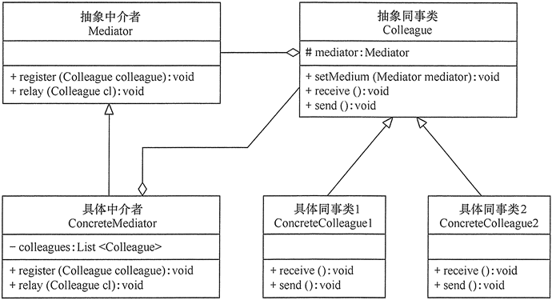
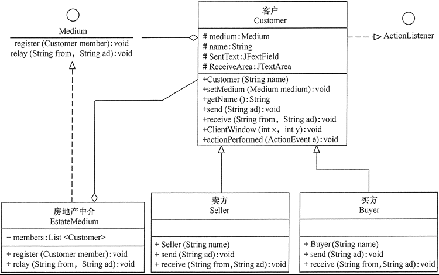

# 中介者模式

在现实生活中，**常常会出现好多对象之间存在复杂的交互关系**，这种交互关系常常是“网状结构”，它要求每个对象都必须知道它需要交互的对象。例如，每个人必须记住他（她）所有朋友的电话；而且，朋友中如果有人的电话修改了，他（她）必须告诉其他所有的朋友修改，这叫作“**牵一发而动全身**”，非常复杂。

如果**把这种“网状结构”改为“星形结构”的话，将大大降低它们之间的“耦合性”**，这时只要找一个“**中介者**”就可以了。如前面所说的“每个人必须记住所有朋友电话”的问题，只要在网上建立一个每个朋友都可以访问的“通信录”就解决了。这样的例子还有很多，例如，你刚刚参力口工作想租房，可以找“房屋中介”；或者，自己刚刚到一个陌生城市找工作，可以找“人才交流中心”帮忙。

在软件的开发过程中，这样的例子也很多，例如，在 MVC 框架中，控制器（C）就是模型（M）和视图（V）的中介者；还有大家常用的 QQ 聊天程序的“中介者”是 QQ 服务器。所有这些，都可以采用“中介者模式”来实现，它将大大降低对象之间的耦合性，提高系统的灵活性。

## 1、中介者模式定义

**定义一个中介对象来封装一系列对象之间的交互，使原有对象之间的耦合松散，且可以独立地改变它们之间的交互**。中介者模式又叫调停模式，它是迪米特法则的典型应用。

## 2、中介者模式的特点

### 中介者模式具有以下优点：

> 降低了对象之间的耦合性，使得对象易于独立地被复用;
> 
> 将对象间的一对多关联转变为一对一的关联，提高系统的灵活性，使得系统易于维护和扩展.
> 

### 中介者模式的缺点是：

> 当同事类太多时，中介者的职责将很大，它会变得复杂而庞大，以至于系统难以维护。
> 

### 应用场景

> 当对象之间存在复杂的网状结构关系而导致依赖关系混乱且难以复用时。
>
> 当想创建一个运行于多个类之间的对象，又不想生成新的子类时。
>

## 3、中介者模式实现

> **抽象中介者（Mediator）角色**：它是中介者的接口，提供了同事对象注册与转发同事对象信息的抽象方法。
> 
> **具体中介者（ConcreteMediator）角色**：实现中介者接口，定义一个 List 来管理同事对象，协调各个同事角色之间的交互关系，因此它依赖于同事角色。
>
> **抽象同事类（Colleague）角色**：定义同事类的接口，保存中介者对象，提供同事对象交互的抽象方法，实现所有相互影响的同事类的公共功能。
>
> **具体同事类（Concrete Colleague）角色**：是抽象同事类的实现者，当需要与其他同事对象交互时，由中介者对象负责后续的交互。
>

中介者模式的结构图如图所示

## 4、示例

用中介者模式编写一个“房地产交流平台”程序。

说明：房地产交流平台是“房地产中介公司”提供给“卖方客户”与“买方客户”进行信息交流的平台，比较适合用中介者模式来实现。

首先，定义一个中介公司（Medium）接口，它是抽象中介者，它包含了客户注册方法 register和信息转发方法 relay；再定义一个房地产中介（EstateMedium）公司，它是具体中介者类，它包含了保存客户信息的 List 对象，并实现了中介公司中的抽象方法。

然后，定义一个客户（Qistomer）类，它是抽象同事类，其中包含了中介者的对象，和发送信息的 send 方法与接收信息的 receive方法的接口。

最后，定义卖方（Seller）类和买方（Buyer）类，它们是具体同事类，是客户（Customer）类的子类，它们实现了父类中的抽象方法，通过中介者类进行信息交流，其结构图如图所示。

