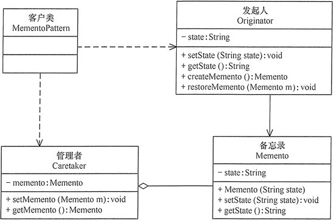

#  备忘录模式

每个人都有犯错误的时候，都希望有种“后悔药”能弥补自己的过失，让自己重新开始，但现实是残酷的。在计算机应用中，客户同样会常常犯错误，能否提供“后悔药”给他们呢？当然是可以的，而且是有必要的。这个功能由“备忘录模式”来实现。

其实很多应用软件都提供了这项功能，如 Word、记事本、Photoshop、Eclipse 等软件在编辑时按 Ctrl+Z 组合键时能撤销当前操作，使文档恢复到之前的状态；还有在 IE 中的后退键、数据库事务管理中的回滚操作、玩游戏时的中间结果存档功能、数据库与操作系统的备份操作、棋类游戏中的悔棋功能等都属于这类。

备忘录模式能**记录一个对象的内部状态，当用户后悔时能撤销当前操作，使数据恢复到它原先的状态**。

## 1、 备忘录模式定义

**在不破坏封装性的前提下，捕获一个对象的内部状态，并在该对象之外保存这个状态，以便以后当需要时能将该对象恢复到原先保存的状态**。该模式又叫快照模式。

## 2、 备忘录模式的特点

###  备忘录模式具有以下优点：

* **提供了一种可以恢复状态的机制**。当用户需要时能够比较方便地将数据恢复到某个历史的状态。。
* **实现了内部状态的封装**。除了创建它的发起人之外，其他对象都不能够访问这些状态信息。
* **简化了发起人类**。发起人不需要管理和保存其内部状态的各个备份，所有状态信息都保存在备忘录中，并由管理者进行管理，这符合单一职责原则。

###  备忘录模式的缺点是：

* **资源消耗大**。如果要保存的内部状态信息过多或者特别频繁，将会占用比较大的内存资源。

### 应用场景

* **需要保存与恢复数据的场景**。如玩游戏时的中间结果的存档功能。
* **需要提供一个可回滚操作的场景**，如 Word、记事本、Photoshop、Eclipse 等软件在编辑时按 Ctrl+Z 组合键，还有数据库中事务操作。

## 3、 备忘录模式实现

* **发起人（Originator）角色**：记录当前时刻的内部状态信息，提供创建备忘录和恢复备忘录数据的功能，实现其他业务功能，它可以访问备忘录里的所有信息。 
* **备忘录（Memento）角色**：负责存储发起人的内部状态，在需要的时候提供这些内部状态给发起人。
* **管理者（Caretaker）角色**：对备忘录进行管理，提供保存与获取备忘录的功能，但其不能对备忘录的内容进行访问与修改。

备忘录模式的结构图如图所示

## 4、示例

利用备忘录模式设计相亲游戏。

分析：假如有西施、王昭君、貂蝉、杨玉环四大美女同你相亲，你可以选择其中一位作为你的爱人；当然，如果你对前面的选择不满意，还可以重新选择，但希望你不要太花心；这个游戏提供后悔功能，用“备忘录模式”设计比较合适。

首先，先设计一个美女（Girl）类，它是备忘录角色，提供了获取和存储美女信息的功能；然后，设计一个相亲者（You）类，它是发起人角色，它记录当 前时刻的内部状态信息（临时妻子的姓名），并提供创建备忘录和恢复备忘录数据的功能；最后，定义一个美女栈（GirlStack）类，它是管理者角色，负责对备忘录进行管理，用于保存相亲者（You）前面选过的美女信息，不过最多只能保存 4 个，提供后悔功能。

客户类包含美女栈（GirlStack）对象和相亲者（You）对象，它实现了 ActionListener 接口的事件处理方法 actionPerformed(ActionEvent e)，并将 4 大美女和相亲者（You）选择的美女显示出来。如图所示是其结构图。

