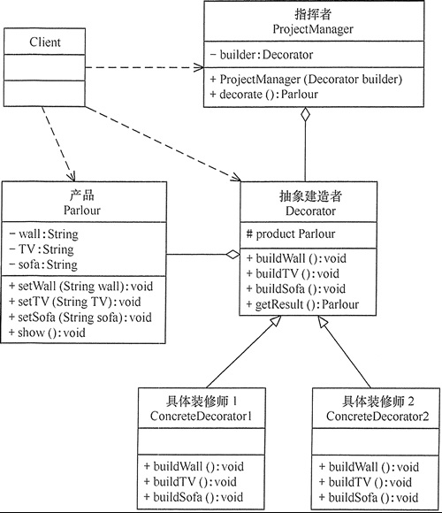

# 建造者模式

在软件开发过程中有时需要创建一个复杂的对象，这个复杂对象通常由多个子部件按一定的步骤组合而成。

这些产品都是由多个部件构成的，各个部件可以灵活选择，但其创建步骤都大同小异。

## 1、建造者模式定义

将一个复杂对象的**构造与它的表示分离**，使同样的构建过程可以创建不同的表示，这样的设计模式被称为建造者模式。

一个复杂的对象分解为多个简单的对象，然后一步一步构建而成。它将变与不变相分离，即产品的组成部分是不变的，但每一部分是可以灵活选择的。

## 2、建造者模式的特点

建造者模式具有以下优点：

> 封装性好，构建和表示分离。
> 
> 扩展性好，各个具体的建造者相互独立，有利于系统的解耦。
> 
> 客户端不必知道产品内部组成的细节，建造者可以对创建过程逐步细化，而不对其它模块产生任何影响，便于控制细节风险。
> 

建造者模式的缺点是：

> 产品的组成部分必须相同，这限制了其使用范围。
> 
> 如果产品的内部变化复杂，如果产品内部发生变化，则建造者也要同步修改，后期维护成本较大。
>

应用场景

> 相同的方法，不同的执行顺序，产生不同的结果。
>
> 多个部件或零件，都可以装配到一个对象中，但是产生的结果又不相同。
>
> 产品类非常复杂，或者产品类中不同的调用顺序产生不同的作用。
>
> 初始化一个对象特别复杂，参数多，而且很多参数都具有默认值

## 3、建造者模式实现

建造者模式包含以下主要角色

> **产品角色（Product）**：它是包含多个组成部件的复杂对象，由具体建造者来创建其各个零部件。
>
> **抽象建造者（Builder）**：它是一个包含创建产品各个子部件的抽象方法的接口，通常还包含一个返回复杂产品的方法 getResult()。
>
> **具体建造者(Concrete Builder）**：实现 Builder 接口，完成复杂产品的各个部件的具体创建方法。
>
> **指挥者（Director）**：它调用建造者对象中的部件构造与装配方法完成复杂对象的创建，在指挥者中不涉及具体产品的信息。
>

## 4、建造者模式和工厂模式的区别

> 建造者模式更加注重**方法的调用顺序**，工厂模式注重**创建对象**。
>
> 创建对象的力度不同，建造者模式创建**复杂**的对象，由各种复杂的部件组成，工厂模式创建出来的对象都一样。
>
> 关注重点不一样，工厂模式只需要把对象**创建**出来就可以了，而建造者模式不仅要**创建**出对象，还要知道对象由哪些部件**组成**。
>
> 建造者模式根据建造过程中的顺序不一样，最终对象部件组成也不一样。
>

## 5、示例

客厅装修是一个复杂的过程，它包含墙体的装修、电视机的选择、沙发的购买与布局等。客户把装修要求告诉项目经理，项目经理指挥装修工人一步步装修，最后完成整个客厅的装修与布局。

这里客厅是产品，包括墙、电视和沙发等组成部分。

具体装修工人是具体建造者，他们负责装修与墙、电视和沙发的布局。

项目经理是指挥者，他负责指挥装修工人进行装修。

UML图如下：

