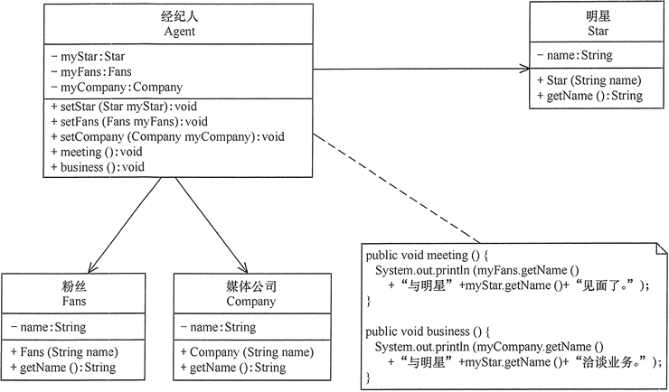

# 迪米特法则

## 一、迪米特法则的定义

迪米特法则（Law of Demeter，**LOD**）又叫作最少知识原则（Least Knowledge Principle，LKP)，产生于 1987 年美国东北大学（Northeastern University）的一个名为迪米特（Demeter）的研究项目，由伊恩·荷兰（Ian Holland）提出，被 UML 创始者之一的布奇（Booch）普及，后来又因为在经典著作《程序员修炼之道》（The Pragmatic Programmer）提及而广为人知。

迪米特法则的定义是：**只与你的直接朋友交谈，不跟“陌生人”说话**（Talk only to your immediate friends and not to strangers）。其含义是：**如果两个软件实体无须直接通信，那么就不应当发生直接的相互调用，可以通过第三方转发该调用。其目的是降低类之间的耦合度，提高模块的相对独立性。**

迪米特法则中的“朋友”是指：当前对象本身、当前对象的成员对象、当前对象所创建的对象、当前对象的方法参数等，这些对象同当前对象存在关联、聚合或组合关系，可以直接访问这些对象的方法。

## 二、迪米特法则的优点

迪米特法则要求限制软件实体之间通信的宽度和深度，正确使用迪米特法则将有以下两个优点。

- 降低了类之间的耦合度，提高了模块的相对独立性。
- 由于亲合度降低，从而提高了类的可复用率和系统的扩展性。

但是，**过度使用迪米特法则会使系统产生大量的中介类，从而增加系统的复杂性，使模块之间的通信效率降低**。所以，在釆用迪米特法则时需要反复权衡，确保高内聚和低耦合的同时，保证系统的结构清晰。

## 三、迪米特法则的实现方法

从迪米特法则的定义和特点可知，它强调以下两点：

- 从依赖者的角度来说，只依赖应该依赖的对象。
- 从被依赖者的角度说，只暴露应该暴露的方法。

所以，在运用迪米特法则时要注意以下 6 点。

- 在类的划分上，应该**创建弱耦合的类**。类与类之间的耦合越弱，就越有利于实现可复用的目标。
- 在类的结构设计上，**尽量降低类成员的访问权限**。
- 在类的设计上，优先考虑将一个类设置成不变类。
- 在对其他类的引用上，将引用其他对象的次数降到最低。
- 不暴露类的属性成员，而应该提供相应的访问器（set 和 get     方法）。
- 谨慎使用序列化（`Serializable`）功能。

【例】明星与经纪人的关系实例：明星由于全身心投入艺术，所以许多日常事务由经纪人负责处理，如与粉丝的见面会，与媒体公司的业务洽淡等。这里的经纪人是明星的朋友，而粉丝和媒体公司是陌生人，所以适合使用迪米特法则，其类图如图 所示。



```c++
// 明星
class Start
{
public:
    Start(std::string name) : m_name(name) {}

    std::string get_name()
    {
        return m_name;
    }

private:
    std::string m_name;
};

// 粉丝
class Fans
{
public:
    Fans(std::string name) : m_name(name) {}

    std::string get_name()
    {
        return m_name;
    }

private:
    std::string m_name;
};

// 媒体公司
class Company
{
public:
    Company(std::string name) : m_name(name) {}

    std::string get_name()
    {
        return m_name;
    }

private:
    std::string m_name;
};

// 经纪人
class Agent
{
public:
    void set_start(Start* start)
    {
        m_start = start;
    }
    void set_fans(Fans* fans)
    {
        m_fans = fans;
    }
    void set_company(Company* company)
    {
        m_company = company;
    }

    void meeting()
    {
        std::cout << m_fans->get_name() + "与明显" + m_start->get_name() + "见面了!" << std::endl;
    }

    void business()
    {
        std::cout << m_company->get_name() + "与明显" + m_start->get_name() + "洽淡业务!" << std::endl;
    }

private:
    Start* m_start;
    Fans* m_fans;
    Company* m_company;
};
```

