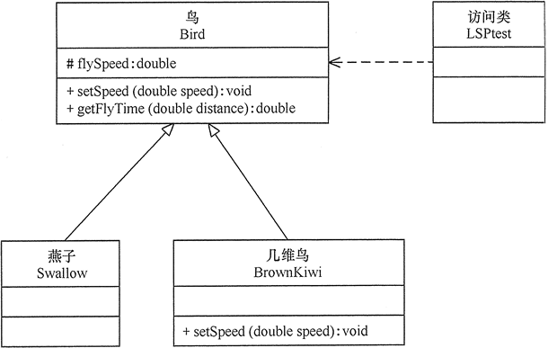
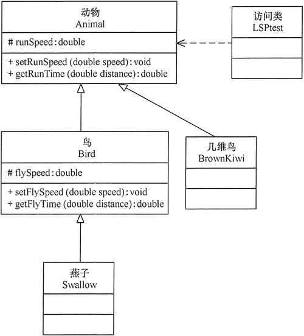

# 里氏替换原则

## 一、里氏替换原则的定义

里氏替换原则（Liskov Substitution Principle，**LSP**）由麻省理工学院计算机科学实验室的里斯科夫（Liskov）女士在 1987 年的“面向对象技术的高峰会议”（OOPSLA）上发表的一篇文章《数据抽象和层次》（Data Abstraction and Hierarchy）里提出来的，她提出：**继承必须确保超类所拥有的性质在子类中仍然成立**（Inheritance should ensure that any property proved about supertype objects also holds for subtype objects）。

里氏替换原则主要阐述了**有关继承的一些原则**，也就是什么时候应该使用继承，什么时候不应该使用继承，以及其中蕴含的原理。里氏替换原是继承复用的基础，它反映了基类与子类之间的关系，是对开闭原则的补充，是对实现抽象化的具体步骤的规范。

## 二、里氏替换原则的作用

* 里氏替换原则是**实现开闭原则的重要方式之一**。
* 它克服了继承中重写父类造成的可复用性变差的缺点。
* 它是**动作正确性的保证**。即类的扩展不会给已有的系统引入新的错误，降低了代码出错的可能性。
* 加强程序的健壮性，同时变更时可以做到非常好的兼容性，提高程序的维护性、可扩展性，降低需求变更时引入的风险。

## 三、里氏替换原则的实现方法

里氏替换原则通俗来讲就是：**子类可以扩展父类的功能，但不能改变父类原有的功能**。也就是说：子类继承父类时，除添加新的方法完成新增功能外，尽量不要重写父类的方法。

根据上述理解，对里氏替换原则的定义可以总结如下：

- 子类可以实现父类的抽象方法，但不能覆盖父类的非抽象方法
- 子类中可以增加自己特有的方法
- 当子类的方法重载父类的方法时，方法的前置条件（即方法的输入参数）要比父类的方法更宽松
- 当子类的方法实现父类的方法时（重写/重载或实现抽象方法），方法的后置条件（即方法的的输出/返回值）要比父类的方法更严格或相等

**通过重写父类的方法来完成新的功能写起来虽然简单，但是整个继承体系的可复用性会比较差，特别是运用多态比较频繁时，程序运行出错的概率会非常大。**

如果程序违背了里氏替换原则，则继承类的对象在基类出现的地方会出现运行错误。这时其修正方法是：取消原来的继承关系，重新设计它们之间的关系。

关于里氏替换原则的例子，最有名的是“正方形不是长方形”。当然，生活中也有很多类似的例子，例如，企鹅、鸵鸟和几维鸟从生物学的角度来划分，它们属于鸟类；但从类的继承关系来看，由于它们不能继承“鸟”会飞的功能，所以它们不能定义成“鸟”的子类。同样，由于“气球鱼”不会游泳，所以不能定义成“鱼”的子类；“玩具炮”炸不了敌人，所以不能定义成“炮”的子类等。

【例】里氏替换原则在“**几维鸟不是鸟**”实例中的应用：鸟一般都会飞行，如燕子的飞行速度大概是每小时 120 千米。但是新西兰的几维鸟由于翅膀退化无法飞行。假如要设计一个实例，计算这两种鸟飞行 300 千米要花费的时间。显然，拿燕子来测试这段代码，结果正确，能计算出所需要的时间；但拿几维鸟来测试，结果会发生“除零异常”或是“无穷大”，明显不符合预期，其类图如图所示。

程序运行错误的原因是：**几维鸟类重写了鸟类的 setSpeed(double speed) 方法，这违背了里氏替换原则。**正确的做法是：**取消几维鸟原来的继承关系，定义鸟和几维鸟的更一般的父类，如动物类，它们都有奔跑的能力。**几维鸟的飞行速度虽然为 0，但奔跑速度不为 0，可以计算出其奔跑 300 千米所要花费的时间。其类图如图所示。

