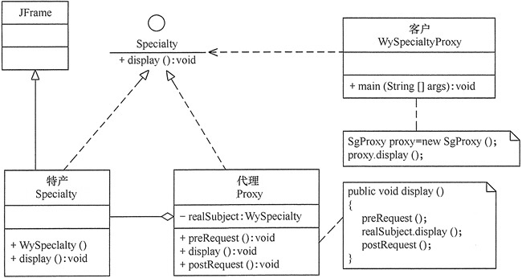

# 代理模式

在有些情况下，**一个客户不能或者不想直接访问另一个对象**，这时需要找一个中介帮忙完成某项任务，这个中介就是代理对象。

例如，购买火车票不一定要去火车站买，可以通过 12306 网站或者去火车票代售点买。

## 1、代理模式定义

由于某些原因**需要给某对象提供一个代理以控制对该对象的访问**。

这时，访问对象不适合或者不能直接引用目标对象，代理对象作为访问对象和目标对象之间的中介。

## 2、代理模式的特点

### 代理模式具有以下优点：

> 代理模式在客户端与目标对象之间起到一个**中介作用**和**保护目标对象**的作用。
> 
> 代理对象可以扩展目标对象的功能。
> 
> 代理模式能将客户端与目标对象分离，在一定程度上**降低了系统的耦合度**，增加了程序的可扩展性。
> 

### 代理模式的缺点是：

> 代理模式会造成系统设计中类的数量增加。
> 
> 在客户端和目标对象之间增加一个代理对象，会造成请求处理速度变慢。
>
> 增加了系统的复杂度.
>

### 应用场景

当无法或不想直接引用某个对象或访问某个对象存在困难时，可以通过代理对象来间接访问。使用代理模式主要有两个目的：一是**保护目标对象**，二是**增强目标对象**。

> **远程代理**：这种方式通常是为了隐藏目标对象存在于不同地址空间的事实，方便客户端访问。例如，用户申请某些网盘空间时，会在用户的文件系统中建立一个虚拟的硬盘，用户访问虚拟硬盘时实际访问的是网盘空间。
>
> **虚拟代理**：这种方式通常用于要创建的目标对象开销很大时。例如，下载一幅很大的图像需要很长时间，因某种计算比较复杂而短时间无法完成，这时可以先用小比例的虚拟代理替换真实的对象，消除用户对服务器慢的感觉。
>
> **安全代理**：这种方式通常用于控制不同种类客户对真实对象的访问权限。
>
> **智能指引**：主要用于调用目标对象时，代理附加一些额外的处理功能。例如，增加计算真实对象的引用次数的功能，这样当该对象没有被引用时，就可以自动释放它。
>
> **延迟加载**：指为了提高系统的性能，延迟对目标的加载。例如，Hibernate 中就存在属性的延迟加载和关联表的延时加载。
>

## 3、代理模式实现

代理模式的结构比较简单，主要是**通过定义一个继承抽象主题的代理来包含真实主题，从而实现对真实主题的访问**。

代理模式包含以下主要角色

> **抽象主题（Subject）类**：通过接口或抽象类声明真实主题和代理对象实现的业务方法。
>
> **真实主题（Real Subject）类**：实现了抽象主题中的具体业务，是代理对象所代表的真实对象，是最终要引用的对象。
>
> **代理（Proxy）类**：提供了与真实主题相同的接口，其内部含有对真实主题的引用，它可以访问、控制或扩展真实主题的功能。
>

## 4、示例

“特产公司”经营许多特产，它是真实主题，提供了显示特产的 display() 方法，可以用窗体程序实现。而代理公司是特产公司特产的代理，通过调用特产公司的 display() 方法显示代理产品，当然它可以增加一些额外的处理，如包裝或加价等。客户可通过代理公司间接访问“特产公司”的产品。

UML图如下：

