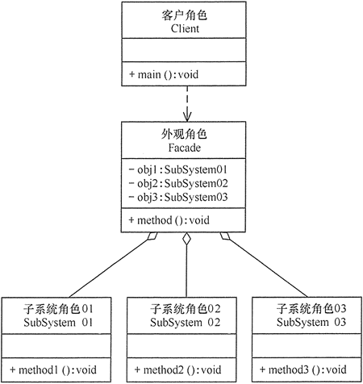

# 外观模式

在现实生活中，**常常存在办事较复杂的例子，如办房产证或注册一家公司，有时要同多个部门联系，这时要是有一个综合部门能解决一切手续问题就好了**。

软件设计也是这样，**当一个系统的功能越来越强，子系统会越来越多，客户对系统的访问也变得越来越复杂。这时如果系统内部发生改变，客户端也要跟着改变**，这违背了“开闭原则”，也违背了“迪米特法则”，所以有必要为多个子系统提供一个统一的接口，从而降低系统的耦合度，这就是外观模式的目标。

## 1、外观模式定义

**一种通过为多个复杂的子系统提供一个一致的接口，而使这些子系统更加容易被访问的模式**。

该模式***对外有一个统一接口**，外部应用程序不用关心内部子系统的具体的细节，这样会大大降低应用程序的复杂度，提高了程序的可维护性。

外观（Facade）模式是“迪米特法则”的典型应用。

## 2、外观模式的特点

### 外观模式具有以下优点：

> 降低了子系统与客户端之间的耦合度，使得子系统的变化不会影响调用它的客户类。
> 
> 对客户屏蔽了子系统组件，减少了客户处理的对象数目，并使得子系统使用起来更加容易。
> 
> 降低了大型软件系统中的编译依赖性，简化了系统在不同平台之间的移植过程，因为编译一个子系统不会影响其他的子系统，也不会影响外观对象。
> 

### 外观模式的缺点是：

> 不能很好地限制客户使用子系统类。
> 
> 增加新的子系统可能需要修改外观类或客户端的源代码，违背了“开闭原则”。
> 

### 应用场景

> 对分层结构系统构建时，使用外观模式定义子系统中每层的入口点可以简化子系统之间的依赖关系。。
>
> 当一个复杂系统的子系统很多时，外观模式可以为系统设计一个简单的接口供外界访问。
>
> 当客户端与多个子系统之间存在很大的联系时，引入外观模式可将它们分离，从而提高子系统的独立性和可移植性。
>

## 3、外观模式实现

外观（Facade）模式的结构比较简单，**主要是定义了一个高层接口**。它包含了对各个子系统的引用，客户端可以通过它访问各个子系统的功能。现在来分析其基本结构和实现方法

外观模式包含以下主要角色

> **外观（Facade）角色**：为多个子系统对外提供一个共同的接口。
>
> **子系统（Sub System）角色**：实现系统的部分功能，客户可以通过外观角色访问它。
>
> **客户（Client）角色**：通过一个外观角色访问各个子系统的功能。
>

UML图如下所示：

## 4、示例

外观模式简单使用
